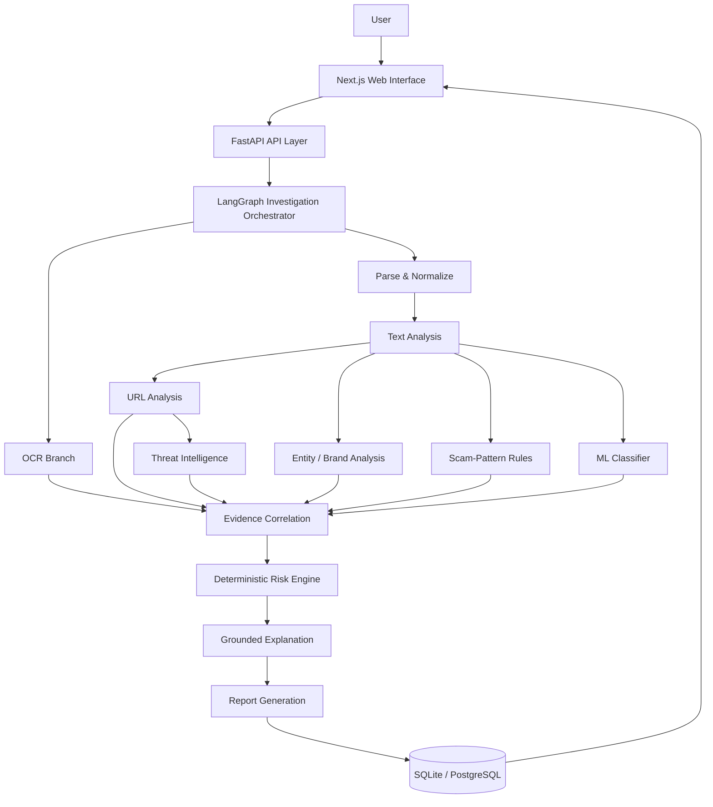

<div align="center">

# 🛡️ ScamIntelligence — AI Digital Scam Investigator

### AI-Powered Digital Scam & Phishing Investigation Platform

Investigate suspicious messages, URLs and screenshots through a multi-layer evidence
pipeline — URL analysis, linguistic signals, scam-pattern rules, entity extraction, machine
learning and threat intelligence — aggregated by a **deterministic risk engine** into an
explainable, audit-friendly investigation report.


> 🚧 **Project status:** active engineering project — a portfolio-grade demonstration of
> agentic investigation systems. Detection is probabilistic decision support, **not** a
> guarantee.

</div>

---

## Table of Contents

- [Overview](#overview)
- [Why ScamIntelligence](#why-scamintelligence)
- [Key Features](#key-features)
- [How It Works](#how-it-works)
- [System Architecture](#system-architecture)
- [Investigation Pipeline](#investigation-pipeline)
- [AI / ML Architecture](#ai--ml-architecture)
- [Risk Scoring](#risk-scoring)
- [Evidence & Explainability](#evidence--explainability)
- [Threat Intelligence](#threat-intelligence)
- [URL Analysis](#url-analysis)
- [Text Analysis](#text-analysis)
- [OCR](#ocr)
- [Entity Extraction](#entity-extraction)
- [Frontend](#frontend)
- [Backend](#backend)
- [API](#api)
- [Data Model](#data-model)
- [Evaluation](#evaluation)
- [Testing](#testing)
- [Security](#security)
- [Installation](#installation)
- [Configuration](#configuration)
- [Usage](#usage)
- [Demo Mode](#demo-mode)
- [Production Providers](#production-providers)
- [Live integration status](#live-integration-status)
- [Live end-to-end acceptance run](#live-end-to-end-acceptance-run)
- [Deployment](#deployment)
- [Project Structure](#project-structure)
- [Limitations](#limitations)
- [Roadmap](#roadmap)
- [Contributing](#contributing)
- [License](#license)

---

## Overview

**ScamIntelligence** treats scam detection as an **investigation problem**, not a chat-style
classification problem. Given a suspicious email, SMS, WhatsApp message, URL, or screenshot, it:

1. extracts structured evidence from every input channel,
2. analyzes each channel with specialised agents,
3. correlates the evidence with quality-aware weighting,
4. computes a **deterministic 0–100 risk score** with per-signal contributors, and
5. produces an explainable report with recommended actions — all stored to an
   investigation history.

The result is an **investigation / risk assessment**. The system never claims to have
"verified" a message as malicious or safe — every verdict is evidence-grounded and carries an
explicit **evidence-sufficiency** label (`SUFFICIENT` / `PARTIAL` / `INSUFFICIENT`).

**What it does:** analyzes structure, language, entities, patterns and available intelligence;
scores risk deterministically; explains why; recommends actions.

**What it does NOT do:** it does not fetch the content of arbitrary URLs (no SSRF surface), it
does not guarantee detection, and in default demo mode it does not consult real external threat
intelligence.

---

## Why ScamIntelligence

| Traditional approach | This project |
|---|---|
| An LLM judges "is this a scam?" from raw text | An **agentic pipeline** extracts evidence first, then scores it |
| The verdict is a black-box probability | **Deterministic risk** with auditable per-signal contributors |
| Silent channels dilute strong signals | **URL-anchored normalization** — a strong malicious URL is never drowned out by neutral text |
| "Low risk" can masquerade as "safe" | Explicit **evidence-sufficiency** labels distinguish *low risk* from *insufficient evidence* |
| Provider failures look like clean results | A failing provider is **no information** — never a clean verdict, never lower risk |

---

## Key Features

| Capability | Description |
|---|---|
| 🔗 **URL Analysis** | Deterministic structural analysis — brand lookalikes, punycode/homoglyph impersonation, IP hosts, dangerous schemes, redirect structures, credential/phishing paths, missing HTTPS. Never fetches the URL. |
| 🧾 **Text Analysis** | Linguistic signal detection — urgency/fear language, credential & OTP requests, payment requests, suspicious instructions, brand impersonation claims. Requestive-only rules keep legitimate OTP/2FA texts, receipts and security notices LOW. |
| 🖼️ **OCR** | Screenshot analysis via Tesseract when installed (auto-detected); deterministic mock fallback otherwise, clearly labeled. |
| 🏷️ **Entity Extraction** | URLs, emails, phone numbers, monetary amounts, companies, banks, organizations, dates — surfaced in the report. |
| 🛰️ **Threat Intelligence** | Google Safe Browsing and VirusTotal providers (live, env-keyed) with a normalized boundary; deterministic demo provider by default. Failures are `unavailable`/`error`/`rate_limited` — never "clean". |
| 🕸️ **Pattern Detection** | 30+ scam-pattern rules across banking, phishing, impersonation, job/advance-fee, delivery, lottery, romance, crypto, tech-support and account-takeover families. |
| 🤖 **ML Signal** | scikit-learn LogisticRegression classifier over language/text features contributes a probability signal — the smallest risk weight by design, never the final verdict. Trained on the real UCI SMS Spam Collection (5,159 messages, CC BY 4.0) — see [AI / ML Architecture](#ai--ml-architecture). |
| ⚖️ **Risk Scoring** | Deterministic weighted engine producing a 0–100 score, risk band (LOW/MEDIUM/HIGH/CRITICAL), confidence and per-signal contributors. |
| 🧩 **Evidence Correlation** | Quality-weighted aggregation — applicable-but-silent channels drop out of normalization; strong evidence is not diluted. |
| ⏱️ **Evidence Timeline** | Every stage of the LangGraph run is recorded with durations (parse, OCR, analyze, URL, entities, intel, ML, correlate, risk, explain, report). |
| 📄 **Explainable Results** | Grounded summary, likely objective, suspicious indicators, recommended actions and a full report — all derived from the structured evidence. |
| 📚 **Investigation History** | Persisted investigations with search, risk-level/type filters and pagination. |

---

## How It Works

```text
User
 ↓
Submit suspicious content (text / URLs / screenshot)
 ↓
FastAPI validation · rate limiting · upload checks
 ↓
LangGraph investigation workflow
 ↓
Parallel analysis channels (URL · text · OCR · entities · intel · ML · patterns)
 ↓
Evidence aggregation & correlation
 ↓
Deterministic risk scoring
 ↓
Explainable result + recommended actions
 ↓
Investigation history
```

---

## System Architecture



**Honesty invariants** enforced in code:

- Evidence is **structured first** — every analysis emits typed signals (`source`, `signal`,
  `severity`, `confidence`, `description`, `detail`), never free-form claims.
- Risk is **deterministic** — the LLM can never change the score; it only synthesizes
  explanations from the evidence it is given.
- Mocks are **labeled** (`is_mock`, `[DEMO]`, `provider_mode`) and surfaced as warnings in the UI.
- Uncertainty is **explicit** — sparse inputs get `INSUFFICIENT` evidence and are worded as
  *"low risk based on available evidence — not a verified safe result"*.

---

## Investigation Pipeline

Typed `InvestigationState` flows through LangGraph nodes:

| Stage | Node | Purpose |
|---|---|---|
| 1 | `parser_node` | Normalize input, extract entities and initial signals |
| 2 | `ocr_node` | Screenshot → text (conditional — only when an image is present) |
| 3 | `text_analysis_node` | Linguistic signals (urgency, fear, requests, instructions) |
| 4 | `url_analysis_node` | Structural URL risk + brand impersonation |
| 5 | `entity_analysis_node` | Entity/brand evidence |
| 6 | `threat_intel_node` | Provider lookups (normalized, failure-safe) |
| 7 | `ml_node` | Classifier probability signal |
| 8 | `correlation_node` | Merge equal-depth branches, weight evidence |
| 9 | `classify_node` | Category + alternatives (rule-engine primary, optional LLM refinement) |
| 10 | `risk_node` | Deterministic 0–100 score, band, sufficiency |
| 11 | `explain_node` | Grounded explanation (LLM or deterministic fallback) |
| 12 | `report_node` | Full structured report |

Parallel branches are padded to equal depth so LangGraph merges them correctly; timeline
entries are de-duplicated defensively.

---

## AI / ML Architecture

### Machine Learning

**Model.** A scikit-learn `LogisticRegression` (StandardScaler → LR, `C=0.8`,
`class_weight="balanced"`) over feature-engineered **language/text signals** — message length,
word counts, urgency/fear/reward/pressure scores, credential/OTP/payment-request intents,
entity presence, punctuation and casing statistics. URL-*presence* features are deliberately
absent: this product investigates suspicious URLs by design, so “a URL is present” is
uninformative for the language model, and URL structural risk is already scored
deterministically by the `url_risk` channel (threat intel included). The model ships as a
`.joblib` pipeline exposed through `app/ml/` (`features`, `classifier`, `service`, `dataset`)
and contributes one weighted input signal — the smallest weight in the engine — it never
overrides the deterministic verdict.

**Training data.** The shipped model is trained on the **real UCI SMS Spam Collection v.1**
(`backend/data/datasets/real/sms_spam_uci.csv`, 5,159 messages, **CC BY 4.0** — full provenance
in `backend/data/datasets/README.md`). The synthetic set (`data/datasets/scam_messages.csv`)
remains for offline pipeline exercise. Training uses the validated loader with stratified
splits, exact-duplicate removal, malformed-row rejection, and a hard guard that refuses the
evaluation corpus (contamination protection). Reproduce with:

```bash
cd backend
.venv/Scripts/python.exe scripts/ml_training/train.py --dataset data/datasets/real/sms_spam_uci.csv --no-categories
```

**ML model evaluation** (held-out test split of the UCI corpus, seed 42):

| Metric | Value |
|---|---|
| Train / validation / test | 3,611 / 516 / 1,032 |
| Class distribution (corpus) | 4,517 benign / 642 scam (13% prevalence) |
| Accuracy | 0.9312 |
| Precision | 0.6748 |
| Recall | 0.8594 |
| F1 | 0.7560 |
| ROC-AUC | 0.9705 |
| Confusion matrix (test) | benign 851/53 · scam 18/110 |
| Decision threshold | 0.55 (max-F1 on the validation split) |

**Honest limits of the real corpus.** The UCI SMS set is **SMS spam/ham supervision** — it is
not a complete phishing/URL/scam dataset: 13% scam prevalence, no crypto-transfer or
URL-heavy content, and English-only messages. Scam categories beyond SMS spam (banking
phishing, impersonation, job/advance-fee, delivery, crypto wallet drains, …) therefore
continue to depend primarily on the deterministic channels — pattern rules, NLP text signals,
URL analysis, threat intelligence and evidence correlation. The ML signal is one probabilistic
input, and the risk engine's smallest weight (`0.10`) reflects that. Do **not** treat SMS-only
training as evidence the model detects every type of scam.

**LLM.** An optional OpenAI-compatible provider (any base URL — `gpt-4o-mini` by default) is
used for classification refinement and explanation/report synthesis. It receives **only the
structured evidence** (`ReportContext`) under an evidence-only prompt contract: it cannot invent
threat-intelligence results or external facts, and it cannot change the risk score. Malformed,
empty or failed LLM output falls back to the deterministic explanation/report
(`provider = "deterministic-fallback"`). Without a key, the system runs fully deterministic.

### Evaluation

Two separate measurement regimes exist, and their numbers must **never** be combined:

| Regime | What it measures | Corpus | Metrics |
|---|---|---|---|
| **ML model evaluation** | The classifier alone, on a held-out split of its own training data (never the evaluation corpus) | Real UCI SMS Spam Collection — 5,159 rows, stratified split | F1 0.756, ROC-AUC 0.9705, precision 0.6748, recall 0.8594 (see [Machine Learning](#machine-learning)) |
| **End-to-end detection calibration** | The whole pipeline (extraction → URL → text → patterns → ML → correlation → risk → report) | 64 **fictional** evaluation cases (24 benign / 40 scam) | Binary F1 0.9873, accuracy 0.9844, precision 1.0, recall 0.975, category accuracy 0.975, 0 false positives, 1 documented false negative |

The 64-case corpus (`backend/data/evaluation/evaluation_cases.json`) is **fictional calibration
material, not real user data** — it is refused by the training loader, never enters ML metrics,
and is not representative of real-world prevalence. Real-data ML metrics come only from the
UCI held-out test split; run both with `scripts/evaluate_detection.py` and
`scripts/ml_training/train.py`.

---

## Risk Scoring

- **Method:** `deterministic_weighted` — component scores × configurable weights, then
  quality-aware normalization.
- **Weights:** live in `DEFAULT_WEIGHTS` (`app/risk/engine.py`), JSON-overridable via
  `RISK_WEIGHTS_PATH`. Current distribution: pattern rules `0.35`, threat intel `0.25`, URL
  `0.18`, credential/OTP requests `0.12` each, payment requests `0.10`, ML `0.10`, entity
  impersonation `0.08`, urgency `0.07`, consistency `0.05`.
- **Bands:** LOW (0–24) · MEDIUM (25–49) · HIGH (50–74) · CRITICAL (75–100).
- **Evidence sufficiency:** `SUFFICIENT` / `PARTIAL` / `INSUFFICIENT` computed from the
  applicable evidence pool.
- **URL-anchored normalization:** when a URL shows strong structural risk (≥ 0.4) or a
  threat-intel verdict is suspicious/malicious, applicable-but-silent channels drop out of the
  normalization denominator — a strong lookalike/credential URL next to neutral text keeps its
  weight instead of being diluted to LOW. An official domain with a benign URL never anchors.
- **Request-intent gating:** a *mention* of OTP/password/payment never counts as a request
  unless a requestive verb is present; protective warnings ("never share your OTP") and
  reassurance ("no action needed") suppress alarm rules — which is what keeps legit 2FA texts,
  receipts and security notices LOW.

---

## Evidence & Explainability

Every investigation stores:

- **Evidence signals** — typed rows with source, signal, severity, confidence, description and
  structured detail (e.g. `url_analysis / URL_RISK / high / 95%`).
- **Risk assessment** — score, band, confidence, method, weights, evidence sufficiency and the
  per-signal contributor list with directional impact.
- **Report** — summary, likely objective + confidence, suspicious indicators, recommended
  actions, limitations, and a sectioned full report.
- **Timeline** — each pipeline stage with its measured duration.

The UI groups evidence by channel (URL, text signals, pattern matches, ML, threat
intelligence, entities/OCR), explains **"Why this score?"** from the actual contributors, and
shows **"Why this was flagged"** from the high/critical severity signals.

---

## Threat Intelligence

| Provider | Mode | Notes |
|---|---|---|
| `MockThreatIntelProvider` | **Demo (default)** | Deterministic, clearly labeled `[DEMO]`; a fictional blocklist; never double-counts URL structural evidence |
| Google Safe Browsing | Live (opt-in) | `GOOGLE_SAFE_BROWSING_API_KEY`, sent in the `x-goog-api-key` **header** — never in the URL, so the credential cannot leak into access logs |
| VirusTotal | Live (opt-in) | `VIRUSTOTAL_API_KEY`, sent in the `x-apikey` header |

**Input validation (hard invariant):** a provider only answers for a well-formed absolute
`http(s)` URL with a real hostname or IP literal (`app/intelligence/base.py::lookupable_url`).
Malformed input — spaces, a bare label, no scheme, an unparseable IPv6 literal — returns
`verdict=unknown` with `status=error` **without any API call**, because "not in the blocklist"
is the answer *every* reputation service gives for a string it cannot check, and reporting that
as clean would silently lower risk.

All providers normalize at the boundary into `ThreatIntelResult`:
`provider`, `verdict` (`safe|suspicious|malicious|unknown`), `status`
(`ok|error|unavailable|rate_limited`), `risk_score`, `reputation`, `categories`, `hits`,
safe `detail`, `checked_at`, `error`. Raw API payloads never leave the provider code.

**Failure behavior (hard invariant):** a provider outage/timeout/rate-limit/exception becomes
`verdict=unknown` with a non-`ok` status — *no information*, never a clean verdict; failures
never crash an investigation, never lower merged risk, and never add weight to the risk
denominator. The manager queries configured providers concurrently (worst-verdict-wins) and
surfaces every per-provider outcome — including failures — so the UI shows exactly who said
what and who was down.

Providers are queried **by URL only** — no server-side fetching of arbitrary URLs.

---

## URL Analysis

Deterministic, non-fetching structural analysis:

- brand lookalike / homoglyph / punycode impersonation (`paypa1.com` → PayPal)
- dangerous schemes (`file:`, `javascript:`), IP-literal hosts, unusual ports
- redirect-heavy structures and URL-shortener fingerprints
- credential/phishing path indicators (`/login`, `/verify`, `/update`)
- missing HTTPS / mixed content signals

Each finding emits a structured evidence signal; the aggregate feeds both the risk engine and
the URL-anchored normalization guard.

---

## Text Analysis

Linguistic rule engines over the normalized text:

- **Urgency / fear language** — account suspension, legal action, limited-time threats
- **Credential / OTP requests** — requestive-verb gated (see [Risk Scoring](#risk-scoring))
- **Payment requests** — amounts, urgency, non-refundable phrasing
- **Suspicious instructions** — gift cards, wire transfers, crypto addresses
- **Impersonation claims** — "we are your bank", "IRS", "CEO"

---

## OCR

`OCR_PROVIDER=auto` (default) detects a local `tesseract` binary at startup:

- **Tesseract available** → real OCR of uploaded screenshots via the system `tesseract` binary
  (invoked as a subprocess; no Python wrapper dependency).
- **Not available** → a deterministic mock OCR provider that emits a clear warning; the
  investigation still completes.

Uploads are sniffed with Pillow, size-capped (10 MB default) and dimension-capped; images are
stored under random names and never sent to any external service.

---

## Entity Extraction

The parser extracts and normalizes: **URLs, emails, phone numbers, monetary amounts, company
names, banks, organizations and dates** — with surrounding context where available. Entities
are persisted, grouped in the UI, and used by brand-impersonation and request-channel rules.

---

## Frontend

Next.js 15 (App Router) + React 19 + TypeScript + Tailwind CSS v3 — a dark cybersecurity SaaS
interface:

- **Landing page** (`/`) — hero with an animated investigation-network visualization, live
  preview card, capabilities, pipeline explainer, architecture and security sections.
- **Dashboard** (`/dashboard`) — live provider/health status strip from `/api/health`, KPI
  cards (real data only — no fabricated trends), animated risk distribution, demo cases,
  recent investigations.
- **Investigate** (`/investigate`) — source selector, message/URL inputs, drag-and-drop
  screenshot upload, animated processing experience.
- **Results** (`/results/[id]`) — animated risk gauge, "Why this score?", grouped evidence,
  threat-intel status per provider, timeline, actions, entities, full report.
- **History** (`/history`) — search, risk/type filters, pagination, delete.

Provider status is rendered **from `/api/health`** — mock/demo providers display honestly as
such, and the UI flips to "live" automatically when keys are configured server-side. No API
keys ever reach the browser.

---

## Backend

FastAPI + Pydantic v2 + SQLAlchemy 2 (async) + LangGraph 0.2.x. Key modules under `backend/app/`:

| Module | Responsibility |
|---|---|
| `agents/` | LangGraph nodes (parse, OCR, analyze, intel, ML, correlate, classify, risk, explain, report) |
| `api/routes/` | `health`, `investigations`, `analyze`, `demo` routers |
| `analysis/` | Linguistic text-signal rules |
| `core/` | Config (`pydantic-settings`), logging, rate limiting, upload security |
| `extraction/` | URL analysis, entity extractor, OCR adapter, text extractor |
| `graph/` | Typed `InvestigationState` + workflow builder |
| `intelligence/` | Provider interface, Safe Browsing, VirusTotal, demo provider, manager |
| `llm/` | Provider interface, OpenAI-compatible client, deterministic fallback, prompt contracts |
| `ml/` | Features, classifier, service, dataset loader, shipped `.joblib` model |
| `patterns/` | Scam-rule engine + category taxonomy |
| `risk/` | Deterministic weighted engine + correlation |
| `schemas/` | Pydantic API contracts |
| `services/` | Investigation orchestration, demo cases |

---

## API

All endpoints under `/api` (docs at `/docs` when the server runs):

| Method | Path | Description |
|---|---|---|
| GET | `/health` | Status + provider/mode summary (LLM, threat intel, ML, OCR, database) |
| POST | `/investigations` | Create an investigation (multipart: `text`, `urls[]`, `title`, `source_label`, `image`) |
| GET | `/investigations` | List, paginated + filterable (`search`, `risk_level`, `scam_type`) |
| GET | `/investigations/{id}` | Full investigation view (risk, evidence, entities, report, timeline) |
| DELETE | `/investigations/{id}` | Delete an investigation |
| POST | `/analyze/text` · `/analyze/url` · `/analyze/image` | Channel-specific analyses |
| GET | `/demo` | List demo cases |
| POST | `/demo/{slug}` | Run a deterministic demo case end-to-end |

---

## Data Model

Tables (SQLite local fallback or PostgreSQL 16 in Docker):

- `investigations` — metadata, status, input types
- `evidence` — structured signals (source, signal, severity, confidence, description, detail)
- `extracted_entities` — typed entities with context
- `analysis_results` — per-branch structured output
- `risk_assessments` — score, band, confidence, method, weights, sufficiency, contributors
- `reports` — summary, objective, indicators, recommendations, sections

---

## Evaluation

A 64-case end-to-end corpus (`data/evaluation/evaluation_cases.json`) pins calibration:
`scripts/evaluate_detection.py` runs every case through the full pipeline and reports binary +
category + band metrics.

| Metric | Value |
|---|---|
| Cases | 64 (24 benign / 40 scam) |
| Accuracy | **98.44%** |
| Precision | **100%** |
| Recall | **97.50%** |
| F1 | **98.73%** |
| Category accuracy | **97.50%** (39/40) |
| Band compliance | **40/40** |
| False positives | **0** |
| False negatives | **1** (documented hard case — subtle doc-link social engineering) |

> These numbers measure the **evaluation corpus** — not a claim of real-world detection rates.

---

## Testing

| Suite | Command | Result |
|---|---|---|
| Backend unit/integration | `cd backend && .venv/Scripts/python.exe -m pytest tests/ -q` | **165 passed**, 11 skipped (opt-in live suites) |
| Live threat-intel / LLM (opt-in) | `RUN_LIVE_INTEL_TESTS=1` / `RUN_LIVE_LLM_TESTS=1` | requires real API keys |
| Live OCR (opt-in) | `RUN_LIVE_OCR_TESTS=1 … -m pytest tests/test_ocr_live.py -q` | **7 passed** with a system Tesseract |
| Evaluation harness | `.venv/Scripts/python.exe scripts/evaluate_detection.py` | 64-case corpus |
| E2E smoke | `.venv/Scripts/python.exe scripts/end_to_end_smoke.py` | 12/12 flows |
| Frontend typecheck | `cd frontend && npm run typecheck` | PASS |
| Frontend build | `npm run build` | PASS |

**The offline suites are hermetic.** `tests/conftest.py` pins every provider to its deterministic
mock implementation, so a developer's local `backend/.env` with real keys can *never* turn `pytest`
into a live-network run or shift the calibration assertions. `scripts/evaluate_detection.py` blanks
the provider keys for the same reason. Only the explicitly opt-in `RUN_LIVE_*` suites use the
network.

`npm run lint` is **not** a usable gate in this repository: `next lint` opens an interactive prompt
to configure ESLint (no config file or ESLint dependency is committed). `typecheck` and `build` are
the enforced frontend checks; lint configuration was deliberately not added just to report a pass.

---

## Security

- **No secrets in the frontend** — API keys are read server-side from environment variables
  only; the UI shows provider *status*, never values.
- **No SSRF surface** — the engine analyzes URL *structure*; it never fetches arbitrary URLs.
- **Safe uploads** — Pillow content sniffing, 10 MB size cap, dimension caps, sanitized
  random filenames, restricted storage.
- **Rate limiting** — per-IP limit on investigation creation (`RATE_LIMIT_PER_MINUTE`, default 30).
- **Input limits** — 50 000-char text cap, 20 URLs per submission.
- **Fail-safe providers** — outages are no-information, never clean verdicts.
- **`.env` ignored** — `.env.example` ships with placeholders only.

---

## Installation

**Prerequisites:** Python 3.13, Node.js ≥ 20.

```bash
# 1. Backend
cd backend
python -m venv .venv
.venv/Scripts/python.exe -m pip install -r requirements.txt   # Windows
# .venv/bin/pip install -r requirements.txt                   # macOS/Linux

# 2. Frontend
cd ../frontend
npm install
```

**Docker (PostgreSQL + backend + frontend):**

```bash
cp .env.example .env    # optional — demo mode works without it
docker compose up --build
```

**Run without Docker:**

```bash
# terminal 1 — backend
cd backend
.venv/Scripts/python.exe -m uvicorn app.main:app --port 8000

# terminal 2 — frontend
cd frontend
npm run dev              # http://localhost:3000
```

The Next dev server proxies `/api/*` to `http://localhost:8000` (`BACKEND_URL` overrides).

---

## Configuration

All settings are environment variables (see `backend/app/core/config.py` and `.env.example`):

| Variable | Default | Purpose |
|---|---|---|
| `DATABASE_URL` | SQLite local | PostgreSQL under docker-compose |
| `LLM_PROVIDER` | `mock` | `mock` \| `openai_compatible` |
| `LLM_API_KEY` / `LLM_BASE_URL` / `LLM_MODEL` | — / — / `gpt-4o-mini` | Live LLM |
| `GOOGLE_SAFE_BROWSING_API_KEY` | — | Live Safe Browsing |
| `VIRUSTOTAL_API_KEY` | — | Live VirusTotal |
| `LLM_TIMEOUT_SECONDS` | `45` | LLM request timeout |
| `THREAT_INTEL_TIMEOUT_SECONDS` | `10` | Provider timeout |
| `OCR_PROVIDER` | `auto` | `auto` \| `tesseract` \| `mock` |
| `TESSERACT_BINARY` | `tesseract` | OCR binary name |
| `OCR_MAX_IMAGE_MB` | `10` | OCR image cap |
| `MAX_UPLOAD_MB` / `MAX_TEXT_LENGTH` / `MAX_URLS_PER_SUBMISSION` | `10` / `50000` / `20` | Input limits |
| `RATE_LIMIT_PER_MINUTE` | `30` | API rate limit |
| `CORS_ORIGINS` | `http://localhost:3000` | Allowed browser origins |
| `RISK_WEIGHTS_PATH` | — | Optional JSON weight overrides |
| `ML_MODEL_PATH` | shipped `.joblib` | Classifier artifact |
| `ML_DECISION_THRESHOLD` | `0.55` | Model label threshold (validated on the UCI validation split) |
| `RUN_LIVE_INTEL_TESTS` / `RUN_LIVE_LLM_TESTS` / `RUN_LIVE_OCR_TESTS` | — | Opt-in live tests (never in CI) |

---

## Usage

1. Open **http://localhost:3000**.
2. **Dashboard** → run a sample investigation, or **New investigation** → paste a message,
   add URLs, or drop a screenshot.
3. Watch the pipeline complete and review the result: risk gauge, "Why this score?",
   grouped evidence, threat-intel status, timeline, recommended actions.
4. Revisit any investigation from **History** (search + filters included).

In demo mode everything runs locally and deterministically — no API keys, no external calls.

---

## Demo Mode

Without any credentials the application runs in **DEMO mode**:

- LLM → deterministic local explanations (`LLM_PROVIDER=mock`)
- Threat intel → labeled demo provider (`[DEMO]`, fictional blocklist)
- OCR → mock (if no Tesseract binary is found)
- ML → the real-data-trained LogisticRegression model (the *external providers* are the only mock components)
- Database → SQLite local file

The health endpoint and dashboard report `demo_mode: true` and every mock artifact is visibly
labeled — the UI never presents demo output as live verification. 11 fictional sample cases
(fake bank KYC, job offer, investment, delivery fee, lottery, tech support, romance, account
takeover, crypto wallet drain, suspicious URL, plus a benign control) run the real pipeline
end-to-end.

---

## Production Providers

Configure server-side environment variables to move to live mode — the UI reflects the change
automatically via `/api/health`:

```bash
# Threat intelligence
GOOGLE_SAFE_BROWSING_API_KEY=...
VIRUSTOTAL_API_KEY=...

# LLM (OpenAI-compatible, any base URL)
LLM_PROVIDER=openai_compatible
LLM_API_KEY=...
LLM_BASE_URL=https://api.openai.com/v1
LLM_MODEL=gpt-4o-mini

# OCR
OCR_PROVIDER=tesseract      # requires the tesseract binary on the host
```

Live tests: `RUN_LIVE_INTEL_TESTS=1` and/or `RUN_LIVE_LLM_TESTS=1` with `pytest`.

---

## Live integration status

What was **actually executed** against real providers (not inferred from configuration). Every
row below is reproducible with the commands in [Testing](#testing).

| Integration | Status | Evidence |
|---|---|---|
| Google Safe Browsing | **CONNECTED** | Live `threatMatches:find` calls succeed. Benign `https://example.com/` → `safe` / `ok`. Google's own documented v4 fixtures (`testsafebrowsing.appspot.com/apiv4/ANY_PLATFORM/{MALWARE,SOCIAL_ENGINEERING}/URL/`) → `malicious` / `ok` with the expected category preserved. Invalid key → `unknown` / `error` (HTTP 400). Malformed input → `unknown` / `error` with **no** HTTP call. |
| VirusTotal | **CONNECTED** | Live `/urls/{id}` lookups succeed. `https://example.com/` and `https://www.wikipedia.org/` → `safe` / `ok`, 0 hits. Unseen URL → `unknown` (HTTP 404, "not seen", *not* clean). Invalid key → `unknown` / `error` (HTTP 401). Public lookups spaced to respect the rate limit; a 429 maps to `rate_limited`. |
| Gemini / LLM | **CONNECTED** | `LLM_PROVIDER=openai_compatible` against Gemini's OpenAI-compatible endpoint. Live explanation, report and classification refinement returned grounded, non-mock output that referenced only evidence present in the context (no invented URLs, brands, organizations or amounts). A provider failure (HTTP 404/503) falls back to the deterministic explanation/report — the investigation still completes. |
| Tesseract OCR | **CONNECTED** | `tesseract v5.5.3.20260724` discovered without an absolute path. A generated phishing screenshot uploaded to `POST /api/analyze/image` extracted 32 words, the embedded URL was analyzed, and the case scored **HIGH 59.4**; a benign notification screenshot scored **LOW 1.8**. A blank/unreadable image returns empty text + an explicit error rather than fabricated text. |
| SQLite (local) | **VERIFIED** | Create / retrieve / history / filters / pagination / delete exercised over HTTP; missing and malformed ids return 404. |
| PostgreSQL | **NOT CONFIGURED / NOT REQUIRED FOR LOCAL** | The server is not installed here; SQLite is the documented local store. `DATABASE_URL` + `docker-compose.yml` carry the PostgreSQL path. |
| Docker | **NOT VERIFIED** | The Docker CLI is not installed in this environment, so `docker compose config/build/up` were not run. The Dockerfiles and compose file are unchanged. |

**Provider/model note.** Google has closed `gemini-2.5-flash` to new API keys and returned 503
(overloaded) for several `*-flash` tiers during verification, so a lighter tier
(`gemini-3.5-flash-lite`) is configured. Any OpenAI-compatible endpoint works — the model is a
single environment variable and is never hardcoded.

---

## Live end-to-end acceptance run

Ten scenarios submitted through the **running application's own HTTP API** (`POST
/api/investigations`) with live Google Safe Browsing, live VirusTotal, live Gemini and real
Tesseract OCR active — no layer bypassed, no expected score hardcoded. Observed outcomes:

| # | Scenario | Risk | Score | Classified as | Evidence sufficiency |
|---|---|---|---|---|---|
| 1 | Bank account suspension phishing | MEDIUM | 38.0 | `banking_scam` | SUFFICIENT |
| 2 | Fake job + advance payment | MEDIUM | 46.6 | `job_scam` | SUFFICIENT |
| 3 | Fake delivery + payment request | MEDIUM | 37.9 | `delivery_scam` | SUFFICIENT |
| 4 | Crypto/investment "guaranteed returns" | LOW | 9.2 | `crypto_scam` | PARTIAL |
| 5 | CEO/executive impersonation + gift cards | MEDIUM | 28.2 | `impersonation_scam` | SUFFICIENT |
| 6 | Lookalike URL only | **HIGH** | 64.2 | `phishing` | SUFFICIENT |
| 7 | Legitimate OTP message | LOW | 5.7 | `unknown` | INSUFFICIENT |
| 8 | Legitimate receipt | LOW | 17.7 | `delivery_scam` (label only) | PARTIAL |
| 9 | Sparse message ("Check this.") | LOW | 0.1 | `unknown` | INSUFFICIENT |
| 10 | Suspicious text + lookalike URL | **HIGH** | 67.8 | `banking_scam` | SUFFICIENT |

Every case completed (`status=completed`), the LLM explanation was live and grounded, and threat
intelligence reported real per-provider outcomes (Safe Browsing `safe`/`ok`, VirusTotal
`unknown`/`ok` for the RFC-2606/`.example` fixtures used — never a fabricated detection).

**Two honest observations from this run (also listed under [Limitations](#limitations)):**

- **Case 4 is a calibration gap.** "Guaranteed 40% returns in 7 days… double your investment
  risk-free" is correctly *classified* as `crypto_scam` (via LLM refinement of an ambiguous rule
  result) but scores **LOW 9.2**, because the deterministic rule engine's literal keyword matcher
  misses the phrasings in that sentence (`guaranteed 40% returns` has a token between the two
  keywords; `risk-free` is hyphenated where the rule has `risk free`). Rules, not the LLM, drive
  the risk channels, so the pattern channel stayed empty. Closing this requires generalising the
  keyword matcher, which also feeds the model's `scam_keyword_hits` feature and would therefore
  require retraining and re-validating the tracked artifact — deliberately not done here.
- **Case 8's category label is imprecise.** A legitimate receipt mentioning "parcel" is labelled
  `delivery_scam` (rule confidence 0.6) while the risk band correctly stays **LOW**. The band is
  what gates the user-facing verdict; the label is advisory.

---

## Deployment

Full instructions — Vercel (frontend), Railway/Render or any container host (backend), managed
PostgreSQL, provider keys, CORS, health check, post-deploy smoke test and troubleshooting — are in
[`docs/DEPLOYMENT.md`](docs/DEPLOYMENT.md).

The short version: the frontend needs only `BACKEND_URL`; the backend needs `DATABASE_URL`, the
provider keys and the LLM settings; API keys are server-side only and must never be exposed to the
browser.

---

## Project Structure

```text
backend/
  app/
    agents/          LangGraph nodes
    analysis/        text-signal rules
    api/routes/      FastAPI routers
    core/            config, logging, security, rate limiting
    extraction/      URL analysis, entities, OCR, text
    graph/           typed state + workflow builder
    intelligence/    threat-intel providers + manager
    llm/             LLM providers + prompt contracts
    ml/              features, classifier, dataset loader, model
    patterns/        scam rules + taxonomy
    risk/            deterministic engine + correlation
    schemas/         Pydantic contracts
    services/        investigation orchestration
  data/
    datasets/        real UCI SMS corpus + synthetic set + provenance docs + training reports
    evaluation/      evaluation_cases.json (tracked)
  scripts/
    evaluate_detection.py   64-case calibration harness
    end_to_end_smoke.py     12-flow E2E smoke    ml_training/            train + evaluate + generate_dataset
  tests/             pytest suites (incl. opt-in live OCR/threat-intel/LLM integration tests) (offline suite is hermetic; live suites are opt-in)
frontend/
  app/               routes: /, /dashboard, /investigate, /history, /results/[id]
  components/        shell, landing, evidence, UI primitives
  lib/               API client + shared types
docker-compose.yml   postgres + backend + frontend
```

---

## Limitations

Honest, current constraints:

- **The shipped ML model is trained on the real UCI SMS corpus** (SMS spam/ham, CC BY 4.0). It
  generalizes well to SMS spam but is **not** a complete phishing/URL/scam dataset — other scam
  categories rely on rules, NLP, URL analysis, threat intelligence and evidence correlation.
- **ML metrics** (F1 0.756 on the UCI held-out test split) measure the *model*; **end-to-end
  detection metrics** (F1 0.987 on the 64-case fictional corpus) measure the *whole pipeline*.
  The two must never be combined — see [AI / ML Architecture](#ai--ml-architecture) and
  [Evaluation](#evaluation).
- **Live integrations were verified against real providers** — see
  [Live integration status](#live-integration-status) for what was actually executed, and which
  checks still require a credential or a host capability this environment did not have.
- **One documented false negative** remains in the corpus (subtle doc-link social engineering).
- **Text rules are English-centric.**
- **Rule-keyword matching is literal.** A phrase split by another token (`guaranteed 40%
  returns`) or hyphenated differently (`risk-free` vs the rule's `risk free`) will not match,
  which can leave an obvious investment scam at a LOW band while the LLM still names the correct
  category. Because the rule matcher also produces the model's `scam_keyword_hits` feature,
  generalising it is a retrain-and-revalidate change, not a one-line patch.
- **Scam-type labels can be imprecise on benign look-alikes** (e.g. a genuine receipt mentioning
  "parcel" is labelled a delivery scam) even when the risk band correctly stays LOW. The band,
  not the label, gates the verdict.
- **Docker configuration is unverified in this environment** (no Docker CLI); it was not modified.
- The system is **decision support** — it produces probabilistic, evidence-based assessments,
  never guarantees.

---

## Roadmap

Concrete, engineering-backed next steps (not commitments):

1. ✅ **Done:** retrained the classifier on the real UCI SMS corpus via the existing loader/trainer.
2. Broaden training data beyond SMS (phishing/URL-heavy labelled corpora) to widen the ML
   channel's coverage while keeping the deterministic channels primary.
3. Parallel provider fan-out with timeouts for lower live-query latency.
3. Multiclass category head so category quality is trained and measured, not rules-only.
4. Add a CI workflow running the full gate (backend pytest, evaluation harness, E2E, frontend
   typecheck + build).

---

## Contributing

Contributions are welcome. Please keep the core invariants intact:

- evidence stays structured and typed,
- risk stays deterministic (LLM never scores),
- provider failures are never "clean",
- mocks stay labeled,
- the evaluation corpus stays green (0 FP, ≤ 1 documented FN).

Open an issue or PR — tests run with `pytest`, the evaluation harness and the E2E smoke.

---

## License

[MIT](./LICENSE) © 2026 Uday Prakash Rastogi
