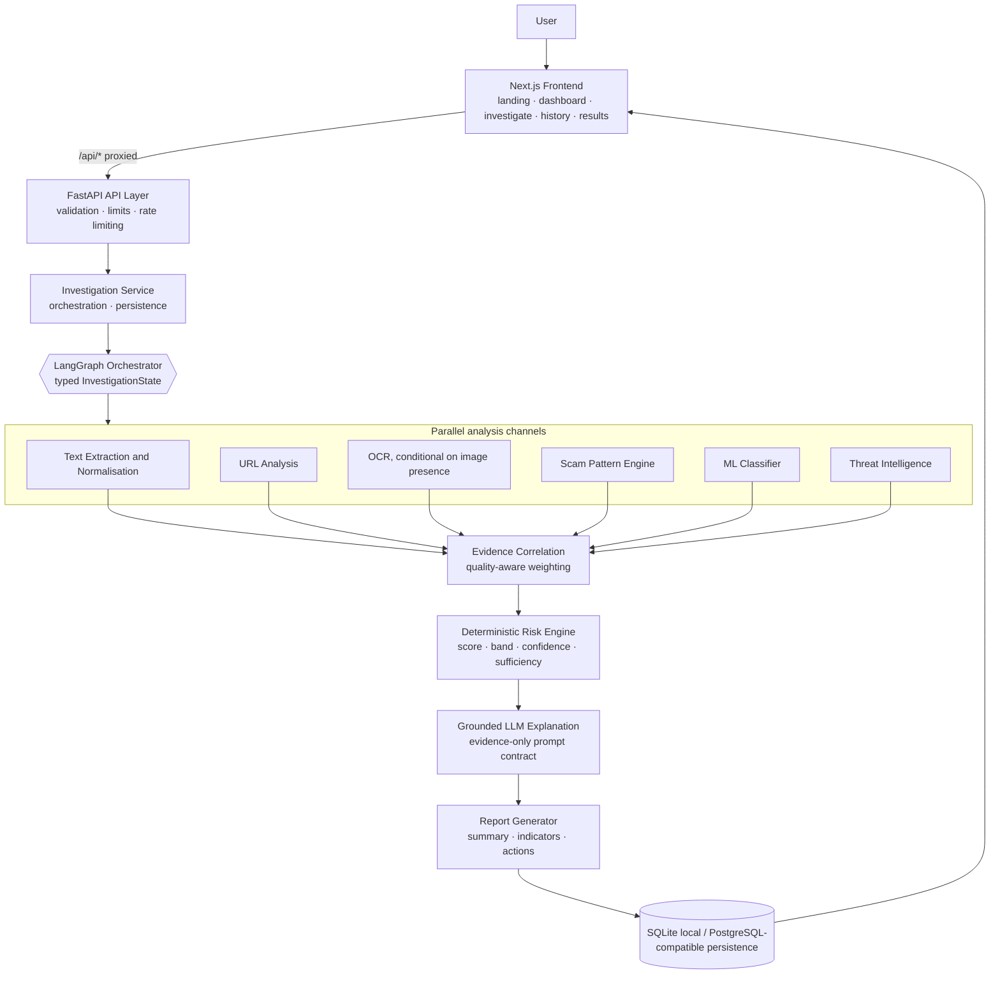
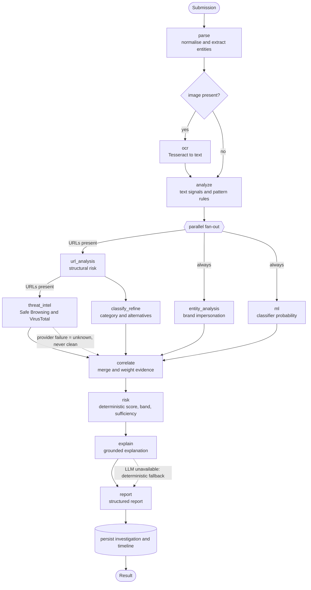

<div align="center">

# 🛡️ AI Digital Scam Investigator

### An evidence-first AI cybersecurity system for investigating suspicious messages, URLs and screenshots in real time.

Investigate suspicious content through a multi-layer evidence pipeline — URL analysis, linguistic
signals, declarative scam-pattern rules, entity extraction, machine learning and live threat
intelligence — aggregated by a **deterministic risk engine** into an explainable, audit-friendly
investigation report.


[Repository](https://github.com/udayrastogi0531/Ai-digital-scam-investigator) ·
[Architecture](docs/ARCHITECTURE.md) ·
[Evaluation](docs/EVALUATION.md) ·
[API](docs/API.md) ·
[Security](docs/SECURITY.md) ·
[Deployment](docs/DEPLOYMENT.md) ·
[Roadmap](docs/ROADMAP.md) ·
[Contributing](docs/CONTRIBUTING.md)

> **Project status:** an actively engineered, portfolio-grade system demonstrating agentic
> investigation architecture. Detection is **probabilistic decision support**, not a guarantee, and
> no cloud deployment is claimed — see [Live integration status](#live-integration-status).

</div>

---

## Table of contents

- [Documentation map](#documentation-map)
- [Project snapshot](#project-snapshot)
- [The problem](#the-problem)
- [The solution](#the-solution)
- [Key features](#key-features)
- [Architecture](#architecture)
- [Investigation flow](#investigation-flow)
- [Risk decision model](#risk-decision-model)
- [Real-time investigation](#real-time-investigation)
- [Evaluation](#evaluation)
- [Live integration status](#live-integration-status)
- [UI and product](#ui-and-product)
- [Product preview](#product-preview)
- [Quick start](#quick-start)
- [Environment variables](#environment-variables)
- [API](#api)
- [Testing](#testing)
- [Security](#security)
- [Demo mode and going live](#demo-mode-and-going-live)
- [Data model and persistence](#data-model-and-persistence)
- [Project structure](#project-structure)
- [Limitations](#limitations)
- [Roadmap](#roadmap)
- [Contributing](#contributing)
- [License and author](#license-and-author)

---

## Documentation map

Every document in this repository, and the question it answers:

| Document | Answers |
|---|---|
| [README](README.md) | What is this, why does it matter, what does it use, and how do I run it? |
| [docs/ARCHITECTURE.md](docs/ARCHITECTURE.md) | How is the system actually built, and which invariants are enforced in code rather than by convention? |
| [docs/EVALUATION.md](docs/EVALUATION.md) | How is detection measured, how do I reproduce it, and what do the numbers *not* mean? |
| [docs/API.md](docs/API.md) | What are the endpoints, contracts, response shapes and error semantics? |
| [docs/SECURITY.md](docs/SECURITY.md) | What is the threat model, what leaves the machine, and what is explicitly not covered? |
| [docs/DEPLOYMENT.md](docs/DEPLOYMENT.md) | How do I deploy this — and which paths were actually verified versus only configured? |
| [docs/PROVIDERS.md](docs/PROVIDERS.md) | How do the threat-intel and LLM integrations work, and how do I add one? |
| [docs/TESTING.md](docs/TESTING.md) | Which suites exist, what does each one cover, and what is deliberately untested? |
| [docs/TROUBLESHOOTING.md](docs/TROUBLESHOOTING.md) | Something is broken — what is the cause and the fix? |
| [docs/FAQ.md](docs/FAQ.md) | Is the 100% figure real? Why is precision only 0.67? Is a URL fetched? |
| [docs/GLOSSARY.md](docs/GLOSSARY.md) | What exactly do band, sufficiency, verdict, anchor and the rest mean in this codebase? |
| [docs/CONTRIBUTING.md](docs/CONTRIBUTING.md) | Where does a change belong, which gates must pass, and what will not be merged? |
| [docs/CHANGELOG.md](docs/CHANGELOG.md) | What changed, when, and why? |
| [docs/ROADMAP.md](docs/ROADMAP.md) | What is planned, what is the acceptance gate for each item, and what is deliberately not planned? |
| [backend/data/datasets/README.md](backend/data/datasets/README.md) | Where does the training data come from, and what are its limits? |
| [LICENSE](./LICENSE) | MIT — © 2026 Uday Prakash Rastogi |

---

## Project snapshot

| Layer | Technology |
|---|---|
| Backend API | FastAPI · Pydantic v2 · Python 3.13 |
| Frontend | Next.js 15 (App Router) · React 19 · TypeScript 5 · Tailwind CSS v3 |
| AI orchestration | LangGraph 0.2.x (typed state, parallel branches, conditional edges) |
| Detection | Declarative scam-pattern rules · linguistic text signals · deterministic URL analysis |
| Machine learning | scikit-learn `LogisticRegression` pipeline (shipped `.joblib` artifact) |
| Threat intelligence | Google Safe Browsing · VirusTotal (header-authenticated, failure-safe) |
| OCR | System **Tesseract** via subprocess (labelled mock fallback) |
| LLM | OpenAI-compatible provider (Gemini verified) for **explanation only** |
| Database | SQLite local (verified) · PostgreSQL 16 via Alembic migrations + opt-in integration suite (configured; **not verified here** — no server installed) |
| Authentication | JWT bearer tokens (`PyJWT`, HS256) · bcrypt password hashing · per-user investigation isolation |
| Packaging | `docker-compose.yml` + Dockerfiles included (not executed in this environment — no Docker CLI) |
| CI | GitHub Actions: backend (SQLite + a PostgreSQL service container), frontend, security & docs link check |

---

## The problem

Modern scams are not single-signal. A realistic message combines:

- **social engineering** — urgency, fear, authority, trust-building
- **URLs** — lookalike domains, homoglyphs, punycode, IP hosts, credential paths, shorteners
- **impersonation** — a claimed bank, courier, employer, government body or executive
- **payment pressure** — fees, deposits, gift cards, crypto transfers
- **credential theft** — OTPs, passwords, verification codes, KYC documents
- **screenshots** — evidence that only exists as an image
- **topical cover stories** — fake delivery notices, job offers, investment claims, invoices

Naive approaches fail for structural reasons:

| Naive approach | Why it fails |
|---|---|
| Keyword blocklists | Trivially bypassed (`40% returns`, `risk-free`, homoglyph domains) and trigger false positives on legitimate receipts and security notices |
| "Ask an LLM if this is a scam" | Non-reproducible, unexplainable, impossible to audit or regression-test, and free to invent findings |
| A single ML classifier probability | Trained on one channel, opaque, and easily diluted by unrelated text |
| Silent channel averaging | A strongly malicious URL gets drowned out by neutral surrounding text |

---

## The solution

Treat detection as an **investigation**, not a chat classification. Every submission is decomposed
into structured, typed evidence; each channel is analysed independently; the evidence is correlated
with quality-aware weighting; and a **deterministic risk engine** produces the score.

```text
INPUT                text · URLs · screenshot
  ↓
NORMALISE            validation · limits · rate limiting
  ↓
EXTRACT EVIDENCE     entities · URLs · text signals · pattern matches
  ↓
MULTI-SOURCE         URL analysis · threat intel · ML · entities · OCR
  INVESTIGATION
  ↓
CORRELATE            quality-aware aggregation · anchors
  ↓
RISK ENGINE          0–100 deterministic score · band · sufficiency
  ↓
GROUNDED AI          explanation and report synthesis
  ↓
REPORT               stored, searchable, auditable
```

> **The LLM never makes the risk decision.** It receives only structured evidence (`ReportContext`)
> under an evidence-only prompt contract and can neither change the score nor assert a scam category
> the deterministic evidence does not support. If the provider is unavailable, the system falls back
> to a deterministic explanation and the investigation still completes.

---

## Key features

### 🔎 Multi-input investigation

| Input | Handling |
|---|---|
| Suspicious message (email / SMS / WhatsApp text) | Normalised, entity-extracted and analysed by the language + pattern channels |
| URL (one or up to 20 per submission) | Deterministic structural analysis; never fetched |
| Screenshot / image | Validated upload → Tesseract OCR → the extracted text enters the **same** pipeline |
| Combined evidence | Text + URL + OCR evidence is correlated as a single investigation |

### 🧠 Evidence-first AI

Every channel emits typed `EvidenceSignal` rows (`source`, `signal`, `severity`, `confidence`,
`description`, `detail`) before any AI runs. The explanation layer is grounded in those rows, so
"why was this flagged?" is answered from recorded evidence rather than a model's opinion.

### 🌐 URL intelligence

Non-fetching structural analysis: brand lookalikes and homoglyphs (`paypa1.com` → PayPal),
punycode and IP-literal hosts, dangerous schemes, unusual ports, excessive subdomains,
credential/phishing paths (`/login`, `/verify`, `/update`), shortener fingerprints, sensitive query
parameters and missing HTTPS. Findings feed both the risk engine and the URL-anchored normalization
guard. Engineering detail: [docs/ARCHITECTURE.md](docs/ARCHITECTURE.md).

### 🛰️ Threat intelligence

| Provider | Mode | Notes |
|---|---|---|
| Google Safe Browsing | Live (env-keyed) | Key sent in the `x-goog-api-key` **header**, never in a URL |
| VirusTotal | Live (env-keyed) | Key sent in the `x-apikey` header |
| Demo provider | Default without keys | Deterministic, labelled `[DEMO]`, fictional blocklist |

Providers are queried **by URL value only** (no server-side fetching → no SSRF surface) and
normalised at the boundary. A failure, timeout, rate limit or unusable input becomes
`verdict=unknown` with a non-`ok` status — **no information**, never a clean verdict, and never a
reason to lower risk.

### 🤖 Machine learning

A scikit-learn `LogisticRegression` (StandardScaler → LR, `C=0.8`, `class_weight="balanced"`) over
engineered language/text features, trained on the **real UCI SMS Spam Collection v.1**
(5,159 messages, CC BY 4.0). It contributes one probability signal at the **smallest weight in the
engine (`0.10`) and never decides the verdict**.

**ML model metrics — held-out UCI test split, `seed=42`** (these measure the *model*, not the
end-to-end product):

| Metric | Value |
|---|---|
| Accuracy | 93.12% |
| Precision | 67.48% |
| Recall | 85.94% |
| F1 | 75.60% |
| ROC-AUC | 97.07% |

The SMS corpus is spam/ham supervision — it does **not** represent the full phishing, URL, crypto,
impersonation or screenshot threat landscape. See [Evaluation](#evaluation).

### 👁️ OCR investigation

`OCR_PROVIDER=auto` detects the system `tesseract` binary at startup (verified with
`tesseract v5.5.3.20260724`). Screenshots are sniffed with Pillow, size- and dimension-capped, and
analysed **in memory** — never written to disk, never sent to an external service. Extracted text flows
into the URL, text-signal, pattern and aggregation channels exactly like pasted text.

### 🧮 Deterministic risk engine

Component scores × configurable weights, normalised over the channels that were actually applicable
to the submission — producing a 0–100 score, a band (`LOW` / `MEDIUM` / `HIGH` / `CRITICAL`), a
confidence, an explicit **evidence-sufficiency** label and a per-signal contributor list. The LLM
cannot change any of it.

### 🧾 Evidence correlation

Multiple weak signals combine into stronger evidence, while strong evidence is protected from
dilution:

- **URL-anchored normalization** — when a URL shows strong structural risk (≥ 0.4) or threat intel
  returns suspicious/malicious, applicable-but-silent channels drop out of the denominator, so a
  credential-harvesting URL is not diluted by neutral text.
- **Channel applicability** — a channel that could never fire for this input type (e.g. URL risk on
  a text-only message) never dilutes the score; an uninformative intelligence answer contributes
  nothing.
- **Consistency** — contradictions between channels dampen the score instead of being averaged away.

### 🛡️ Security engineering

Server-side secrets, no SSRF surface, distrust of client-declared content types, bounded uploads that
are never persisted to disk, an image-dimension cap, bounded image concurrency, per-IP rate limiting,
JSON logs that exclude raw
message bodies, and no `eval`/`exec` anywhere. Details: [Security](#security).

---

## Architecture


```mermaid
flowchart TD
    U[User] --> FE["Next.js Frontend<br/>landing · dashboard · investigate · history · results"]
    FE -->|"/api/* proxied"| API["FastAPI API Layer<br/>validation · limits · rate limiting"]
    API --> SVC["Investigation Service<br/>orchestration · persistence"]
    SVC --> ORCH{{"LangGraph Orchestrator<br/>typed InvestigationState"}}

    subgraph CH["Parallel analysis channels"]
        direction TB
        TEXT["Text Extraction and Normalisation"]
        URLNODE["URL Analysis"]
        OCRNODE["OCR, conditional on image presence"]
        PAT["Scam Pattern Engine"]
        MLNODE["ML Classifier"]
        INTEL["Threat Intelligence"]
    end

    ORCH --> CH
    TEXT --> CORR["Evidence Correlation<br/>quality-aware weighting"]
    URLNODE --> CORR
    OCRNODE --> CORR
    PAT --> CORR
    MLNODE --> CORR
    INTEL --> CORR

    CORR --> RISK["Deterministic Risk Engine<br/>score · band · confidence · sufficiency"]
    RISK --> LLMN["Grounded LLM Explanation<br/>evidence-only prompt contract"]
    LLMN --> REP["Report Generator<br/>summary · indicators · actions"]
    REP --> DB[("SQLite local / PostgreSQL-compatible persistence")]
    DB --> FE
```

Engineering invariants enforced in code:

- **Evidence is structured first** — no free-form claims travel between stages.
- **Risk is deterministic** — reproducible, auditable, regression-tested.
- **Mocks are labelled** (`is_mock`, `[DEMO]`, provider mode) and surfaced as UI warnings.
- **Uncertainty is explicit** — sparse inputs report *"low risk based on available evidence — not a
  verified safe result"* instead of a clean result.

---

## Investigation flow


```mermaid
flowchart TD
    SUBMIT([Submission]) --> PARSE["parse<br/>normalise and extract entities"]
    PARSE --> IMGQ{image present?}
    IMGQ -->|yes| OCRN["ocr<br/>Tesseract to text"]
    IMGQ -->|no| ANALYZE["analyze<br/>text signals and pattern rules"]
    OCRN --> ANALYZE

    ANALYZE --> FAN{{"parallel fan-out"}}
    FAN -->|"URLs present"| URLN["url_analysis<br/>structural risk"]
    FAN -->|always| ENTN["entity_analysis<br/>brand impersonation"]
    FAN -->|always| MLN["ml<br/>classifier probability"]
    URLN -->|"URLs present"| INTELN["threat_intel<br/>Safe Browsing and VirusTotal"]
    URLN --> CLASSN["classify_refine<br/>category and alternatives"]

    INTELN --> CORR["correlate<br/>merge and weight evidence"]
    ENTN --> CORR
    MLN --> CORR
    CLASSN --> CORR

    CORR --> RISKN["risk<br/>deterministic score, band, sufficiency"]
    RISKN --> EXPLAINN["explain<br/>grounded explanation"]
    EXPLAINN --> REPORTN["report<br/>structured report"]
    REPORTN --> PERSIST[("persist investigation and timeline")]
    PERSIST --> DONE([Result])

    INTELN -.->|"provider failure = unknown, never clean"| CORR
    EXPLAINN -.->|"LLM unavailable: deterministic fallback"| REPORTN
```

Conditional paths: OCR runs only for image submissions; the URL and threat-intel branches run only
when URLs are present; provider failures degrade to *no information* rather than a clean verdict;
and the explanation falls back deterministically when no LLM is configured.

---

## Risk decision model

Five separate concepts, deliberately not conflated:

| Concept | Question it answers | Where it comes from |
|---|---|---|
| **Evidence** | What did we actually observe? | Typed signals emitted by each analysis channel |
| **Risk** | How dangerous is this, on 0–100? | Deterministic weighted engine over applicable channels |
| **Confidence** | How much independent evidence backs the assessment? | Volume, source diversity, severity, corroboration, live providers |
| **Sufficiency** | `INSUFFICIENT` / `PARTIAL` / `SUFFICIENT` | The same evidence pool, reported explicitly |
| **Explanation** | Why, and what should the user do? | Grounded AI synthesis (or deterministic fallback) |

**Risk bands:** `LOW` 0–24 · `MEDIUM` 25–49 · `HIGH` 50–74 · `CRITICAL` 75–100.

**Channel weights** (`DEFAULT_WEIGHTS`, JSON-overridable via `RISK_WEIGHTS_PATH`): pattern rules
`0.35` · threat intel `0.25` · URL `0.18` · credential and OTP requests `0.12` each · payment request
`0.10` · ML `0.10` · suspicious instructions `0.08` · entity impersonation `0.08` · urgency `0.07` ·
sensitive info `0.07` · consistency `0.05`.

**Request-intent gating.** A *mention* of an OTP, password or payment is not a request: request
channels require a requestive verb, protective warnings ("never share your OTP") and reassurance
("no action needed") suppress alarm rules, and status-only delivery wording ("your parcel could not
be delivered") counts as evidence only when the message also asks for something or applies pressure.
That is what keeps genuine 2FA texts, receipts and security notices `LOW` while the same wording
plus a fee demand escalates.

---

## Real-time investigation

The application performs **on-demand, live investigations**:

1. a user submits evidence (text, URLs, screenshot, or any combination) through the API or UI;
2. the backend runs the investigation immediately, querying whichever **live providers are
   configured** (Safe Browsing, VirusTotal, the LLM) alongside the deterministic channels;
3. evidence is correlated and scored deterministically;
4. the risk assessment and report are returned in the response and persisted to history.

This is **not** a 24/7 monitoring or streaming platform: there are no background workers, queues,
scheduled scans or alerting pipelines. Each investigation is a synchronous request whose latency is
dominated by the live provider calls it makes.

---

## Evaluation

Two measurement regimes exist and their numbers must **never** be combined. This section summarises
both; the full methodology, protocol, composition and limits are in
**[docs/EVALUATION.md](docs/EVALUATION.md)**.

### Section A — end-to-end calibration corpus

`backend/data/evaluation/evaluation_cases.json` holds **64 fictional cases** (24 benign including
9 hard negatives, 40 scam across 14 named categories plus 2 intentionally unlabelled).
`scripts/evaluate_detection.py` runs every case through the **real API pipeline** (mock LLM + mock
threat intel, the shipped ML model) and reports binary, category and band metrics.

| Metric | Value |
|---|---|
| Cases | 64 — 24 benign / 40 scam (45 text, 11 URL, 8 text+URL) |
| Confusion matrix | TP 40 · FP 0 · FN 0 · TN 24 |
| Accuracy | **100%** |
| Precision | **100%** |
| Recall | **100%** |
| F1 | **100%** |
| Category accuracy | **100%** (40/40) |
| Band compliance | **40/40** |
| Errors | 0 |

| Input type | Accuracy | Confusion |
|---|---|---|
| Text | 1.00 | TP 28 · FP 0 · FN 0 · TN 17 |
| URL only | 1.00 | TP 6 · FP 0 · FN 0 · TN 5 |
| Text + URL | 1.00 | TP 6 · FP 0 · FN 0 · TN 2 |

> ⚠️ This is a **calibration / regression** result on 64 fictional cases with mock providers — it is
> **not** a real-world detection-accuracy claim. Its purpose is to keep documented failure modes
> fixed: every case is a frozen regression, benign hard negatives (legitimate OTP warnings, receipts,
> carrier tracking notices, security disclaimers) must stay `LOW`, and a regression fails the suite.
> The corpus declares its own hard cases (`hard_negatives`, `hard_positives`) so the adversarial
> cases are visible rather than implied.

### Section B — ML held-out evaluation

The classifier alone, on a stratified held-out test split of its own real training corpus
(UCI SMS Spam Collection v.1 — 5,159 rows, `seed=42`, split 3,611 / 516 / 1,032, decision threshold
`0.55`):

| Metric | Value |
|---|---|
| Accuracy | 93.12% |
| Precision | 67.48% |
| Recall | 85.94% |
| F1 | 75.60% |
| ROC-AUC | 97.07% |

A separate full-corpus sanity run (`scripts/ml_training/evaluate.py`, which applies the shipped model
to all 5,159 rows rather than to a held-out split) reports accuracy 0.9353 · precision 0.6920 ·
recall 0.8645 · F1 0.7687 · ROC-AUC 0.9741. It is a diagnostic, not a generalisation estimate.

**Honest limits of the real corpus.** The UCI set is SMS spam/ham supervision: 13% scam prevalence,
English-only, no URL-bearing rows at all. Categories beyond SMS spam (banking phishing,
impersonation, job/advance-fee, delivery, crypto wallet drains…) therefore depend primarily on the
deterministic channels. SMS-only training is **not** evidence that the model detects every type of
scam.

**Separation is enforced in code**, not merely documented: `app/ml/dataset.py` refuses to load
anything under `data/evaluation/` and rejects rows whose ids overlap evaluation cases.

---

## Live integration status

What was **actually executed** against real providers — not inferred from configuration.

| Integration | Status | Evidence |
|---|---|---|
| Google Safe Browsing | **CONNECTED** | Live `threatMatches:find` succeeds. Benign `https://example.com/` → `safe`/`ok`; Google's documented v4 test fixtures → `malicious`/`ok` with the expected category; invalid key → `unknown`/`error` (HTTP 400); malformed input → `unknown`/`error` with **no** HTTP call |
| VirusTotal | **CONNECTED** | Live `/urls/{id}` lookups succeed. Benign URLs → `safe`/`ok`, 0 hits; unseen URL → `unknown` (HTTP 404, "not seen" — *not* clean); invalid key → `unknown`/`error` (HTTP 401); rate limit → `rate_limited` |
| Gemini / LLM | **CONNECTED** | `LLM_PROVIDER=openai_compatible` against Gemini's OpenAI-compatible endpoint. Live explanation, report and classification refinement returned grounded, non-mock output referencing only evidence present in the context |
| Tesseract OCR | **CONNECTED** | `tesseract v5.5.3.20260724` discovered without an absolute path. A generated phishing screenshot through `POST /api/analyze/image` extracted 32 words, its embedded URL was analysed, and the case scored **HIGH 59.4**; a benign notification screenshot scored **LOW 1.8**; a blank image returns empty text plus an explicit error, never fabricated text |
| SQLite (local) | **VERIFIED** | Create / retrieve / history / filters / pagination / delete exercised over HTTP; missing and malformed ids return 404 |
| PostgreSQL | **NOT CONFIGURED LOCALLY** | Not installed in this environment; SQLite is the verified local store. `DATABASE_URL` plus `docker-compose.yml` carry the PostgreSQL path (engine-portable filters are implemented, but that path was not executed here) |
| Docker | **NOT VERIFIED** | The Docker CLI is not installed in this environment, so `docker compose config/build/up` were not run. The Dockerfiles and compose file are unchanged and untested here |
| Cloud deployment | **PREPARED, NOT PERFORMED** | No frontend or backend deployment exists yet. [docs/DEPLOYMENT.md](docs/DEPLOYMENT.md) documents the exact path, and a one-click [`render.yaml`](render.yaml) Blueprint provisions the backend + managed PostgreSQL (secrets supplied in the dashboard, never committed) |

### Historical live acceptance run

Ten scenarios were submitted through the **running application's own HTTP API** with live Safe
Browsing, live VirusTotal, live Gemini and real Tesseract OCR active — no layer bypassed, no expected
score hardcoded. Recorded outcomes (kept exactly as observed):

| # | Scenario | Risk | Score | Classified as |
|---|---|---|---|---|
| 1 | Bank account suspension phishing | MEDIUM | 38.0 | `banking_scam` |
| 2 | Fake job + advance payment | MEDIUM | 46.6 | `job_scam` |
| 3 | Fake delivery + payment request | MEDIUM | 37.9 | `delivery_scam` |
| 4 | Crypto/investment "guaranteed returns" | LOW | 9.2 | `crypto_scam` |
| 5 | CEO impersonation + gift cards | MEDIUM | 28.2 | `impersonation_scam` |
| 6 | Lookalike URL only | **HIGH** | 64.2 | `phishing` |
| 7 | Legitimate OTP message | LOW | 5.7 | `unknown` |
| 8 | Legitimate receipt | LOW | 17.7 | `delivery_scam` (label only) |
| 9 | Sparse message ("Check this.") | LOW | 0.1 | `unknown` |
| 10 | Suspicious text + lookalike URL | **HIGH** | 67.8 | `banking_scam` |

Every case completed with status `completed`, explanations were live and grounded, and threat
intelligence reported real per-provider outcomes (Safe Browsing `safe`/`ok`; VirusTotal
`unknown`/`ok` for the RFC-2606 `.example` fixtures — never a fabricated detection).

**Both issues this run surfaced have since been fixed in the deterministic engine** (the run itself
was not re-executed, so its numbers stand as observed):

- **Case 4 was a calibration gap.** The rule matcher compared literal keyword strings with word
  boundaries, so `guaranteed 40% returns` (a token *inside* the keyword `guaranteed returns`) and the
  hyphenated `risk-free` (the rule held `risk free`) never matched, and the case fell to LOW on the
  ML channel alone. Rules now also evaluate declarative **regex variants** (`ScamRule.patterns`) over
  the normalised text, with numeric pressure/reward signals: the same sentence now scores
  **MEDIUM 38.7** and is classified `investment_scam` by the deterministic rules alone. Because the
  matcher also feeds the model's `scam_keyword_hits` feature, the tracked artifact was retrained and
  re-validated on the same UCI corpus (identical held-out metrics).
- **Case 8's label was imprecise.** A legitimate receipt mentioning "parcel" was labelled
  `delivery_scam` while the band correctly stayed LOW. Status-only delivery rules now require scam
  context (`requires_request_context`): "your parcel could not be delivered" is evidence only when
  the message also asks for something or applies pressure. The receipt now scores **LOW 2.9 /
  `unknown`**, while a genuine fee demand ("Pay the $2.99 redelivery fee within 24 hours") still
  reaches **MEDIUM 35.6 / `delivery_scam`** and a real carrier notice with an official tracking link
  stays LOW. A live LLM can no longer override this: refinement only chooses *which* scam an
  ambiguous case is, so when no deterministic evidence supports a category the model's suggestion is
  recorded as rejected (`classification_suggestion_rejected`) instead of replacing the honest
  `unknown` verdict.

---

## UI and product

Next.js 15 App Router + React 19 + TypeScript + Tailwind — a dark cybersecurity console:

| Route | Purpose |
|---|---|
| `/` | Landing page — hero, live preview card, capabilities, pipeline explainer, architecture and security sections |
| `/dashboard` | Provider/health strip from `/api/health`, KPI cards (**real data only, no fabricated trends**), risk distribution, demo cases, recent investigations |
| `/investigate` | New investigation — source selector, message/URL inputs, drag-and-drop screenshot upload, live processing experience |
| `/results/[id]` | Risk gauge, **"Why this score?"** from actual contributors, grouped evidence, per-provider threat-intel status, timeline, recommended actions, entities, full report |
| `/history` | Search, risk-level and scam-type filters, pagination, delete |

Provider status is rendered **from `/api/health`**: mock/demo providers display honestly as such, and
the UI flips to "live" automatically once keys are configured server-side. **No API key ever reaches
the browser.**

---

## Product preview

The interface is a working Next.js application (`/`, `/dashboard`, `/investigate`, `/results/[id]`,
`/history`). No screenshots are committed to this repository: none were fabricated, and no image
links below would resolve.

<!-- Add real captures here once available:
<p align="center">
  
  
</p>
-->

To add them: capture the running app, commit the files under `docs/screenshots/`, then uncomment the
block above. Until then, run it locally with [Quick start](#quick-start) — `npm run dev` in
`frontend/` with the backend on port 8000.

---

## Quick start

**Prerequisites:** Python 3.13 and Node.js ≥ 20. Nothing else is required — demo mode runs fully
offline and deterministically.

```bash
# 1. Clone
git clone https://github.com/udayrastogi0531/Ai-digital-scam-investigator.git
cd Ai-digital-scam-investigator

# 2. Backend environment
cd backend
python -m venv .venv
.venv/Scripts/python.exe -m pip install -r requirements.txt   # Windows
# .venv/bin/pip install -r requirements.txt                   # macOS / Linux

# 3. Frontend dependencies
cd ../frontend
npm install
```

```bash
# 4. Run — terminal 1 (backend)
cd backend
.venv/Scripts/python.exe -m uvicorn app.main:app --port 8000
#   → interactive API docs at http://localhost:8000/docs

# 5. Run — terminal 2 (frontend)
cd frontend
npm run dev                      # http://localhost:3000
```

The Next dev server proxies `/api/*` to `http://localhost:8000` (`BACKEND_URL` overrides the target),
so the browser only ever talks to the frontend origin. **No keys are required** — the default is fully
offline demo mode.

**Create an account first.** Every investigation endpoint requires a bearer token, so the app opens on
`/login`: choose **Create one**, register with an email and a password of at least 8 characters, and
you land on the dashboard. Investigations are private to the account that created them. Provider keys
stay optional — registering is the only setup step.

To enable providers, copy `backend/.env.example` to `backend/.env` and fill in only what you have.
Leave `DATABASE_URL` unset so the verified local SQLite store is used: the repository's root
`.env.example` is the **docker-compose template**, and it points `DATABASE_URL` at the containerised
PostgreSQL — copying that one wholesale makes a local run try to reach a database that is not there.
`frontend/.env.local.example` is optional too (the backend is already reachable on port 8000).

**Docker (PostgreSQL + backend + frontend)** — configuration is included but **unverified here**
(no Docker CLI in this environment):

```bash
cp .env.example .env      # optional — demo mode works without it
docker compose up --build
```

---

## Environment variables

Names and defaults only — never values. Full reference: `backend/app/core/config.py`, with templates at
`backend/.env.example` (local, SQLite-first — the one to copy for a local run) and `.env.example` at the
repository root (docker-compose). `backend/.env` is git-ignored and must never be committed.

| Variable | Default | Purpose |
|---|---|---|
| `DATABASE_URL` | SQLite local file | `postgresql+asyncpg://…` for the PostgreSQL path |
| `POSTGRES_PASSWORD` | `scaminv` (compose) | Password for the bundled postgres service — change it for anything shared |
| `AUTH_SECRET_KEY` | insecure dev key | **Required for real deployments** — signs access tokens |
| `AUTH_TOKEN_EXPIRE_MINUTES` | `1440` | Access-token lifetime (24 h) |
| `AUTH_PASSWORD_MIN_LENGTH` | `8` | Minimum password length |
| `LLM_PROVIDER` | `mock` | `mock` \| `openai_compatible` |
| `LLM_API_KEY` | — | Live LLM credential (server-side only) |
| `LLM_BASE_URL` | — | Any OpenAI-compatible `/v1` base |
| `LLM_MODEL` | `gpt-4o-mini` | Model name (never hardcoded in source) |
| `LLM_TIMEOUT_SECONDS` | `45` | LLM request timeout |
| `GOOGLE_SAFE_BROWSING_API_KEY` | — | Live Safe Browsing (`x-goog-api-key` header) |
| `VIRUSTOTAL_API_KEY` | — | Live VirusTotal (`x-apikey` header) |
| `THREAT_INTEL_TIMEOUT_SECONDS` | `10` | Provider timeout |
| `OCR_PROVIDER` | `auto` | `auto` \| `tesseract` \| `mock` |
| `TESSERACT_BINARY` | `tesseract` | Binary name or path |
| `OCR_MAX_IMAGE_MB` | `10` | OCR image size cap |
| `MAX_UPLOAD_MB` | `10` | Upload size cap |
| `MAX_TEXT_LENGTH` | `50000` | Text input cap (characters) |
| `MAX_URLS_PER_SUBMISSION` | `20` | URL count cap |
| `RATE_LIMIT_PER_MINUTE` | `30` | Per-IP limit on investigation creation |
| `MAX_CONCURRENT_IMAGE_OPS` | `4` | Per-process cap on concurrent image/OCR investigations (503 beyond it) |
| `CORS_ORIGINS` | `http://localhost:3000` | Allowed browser origins (unnecessary when the proxy is used) |
| `ML_MODEL_PATH` | bundled `.joblib` | Classifier artifact path |
| `ML_DECISION_THRESHOLD` | `0.55` | Model label threshold (validated on the UCI validation split) |
| `RISK_WEIGHTS_PATH` | — | Optional JSON overrides for risk weights |
| `DEBUG` | `false` | Leave `false` outside local development |
| `BACKEND_URL` | `http://localhost:8000` | Frontend → backend proxy target (frontend service) |
| `RUN_LIVE_INTEL_TESTS` / `RUN_LIVE_LLM_TESTS` / `RUN_LIVE_OCR_TESTS` | — | Opt-in live test switches (never set in CI) |

---

## API

All routes are mounted under `/api` (interactive docs at `/docs` while the server runs). Full request
and response reference, including error semantics and a worked walkthrough: **[docs/API.md](docs/API.md)**.

Everything except `GET /api/health`, `POST /api/auth/register`, `POST /api/auth/login` and
`GET /api/demo` requires `Authorization: Bearer <token>`; a missing or invalid token returns `401`.

| Method | Path | Auth | Purpose |
|---|---|---|---|
| `GET` | `/api/health` | Public | Status + provider/mode summary (LLM, threat intel, ML, OCR, database) |
| `POST` | `/api/auth/register` | Public | Create an account; returns an access token |
| `POST` | `/api/auth/login` | Public | Exchange email + password for an access token |
| `GET` | `/api/auth/me` | Bearer | The authenticated account |
| `POST` | `/api/auth/logout` | Bearer | Acknowledge logout (client discards its token) |
| `POST` | `/api/investigations` | Bearer | Create an investigation — multipart: `text`, `urls[]`, `title`, `source_label`, `image` (rate-limited) |
| `GET` | `/api/investigations` | Bearer | List **your** investigations — paginated and filterable (`search`, `risk_level`, `scam_type`) |
| `GET` | `/api/investigations/{id}` | Bearer | Full view of **your** investigation (`404` for anyone else's) |
| `DELETE` | `/api/investigations/{id}` | Bearer | Delete your investigation (`204`) |
| `POST` | `/api/analyze/text` | Bearer | Text-only analysis |
| `POST` | `/api/analyze/url` | Bearer | URL-only analysis |
| `POST` | `/api/analyze/image` | Bearer | Screenshot analysis (OCR → pipeline) |
| `GET` | `/api/demo` | Public | List the built-in demo cases |
| `POST` | `/api/demo/{slug}` | Bearer | Run a demo case end-to-end (owned by the caller) |

---

## Testing

| Suite | Command (from `backend/`) | Verified result |
|---|---|---|
| Backend unit + integration | `.venv/Scripts/python.exe -m pytest tests/ -q` | **239 passed**, 12 skipped |
| Detection calibration | `.venv/Scripts/python.exe scripts/evaluate_detection.py` | 64 cases · F1 1.0 · 0 FP · 0 FN · band 40/40 · 0 errors |
| End-to-end smoke | `.venv/Scripts/python.exe scripts/end_to_end_smoke.py` | **12/12** flows |
| Authentication | `.venv/Scripts/python.exe -m pytest tests/test_auth.py -q` | 21 passed |
| Authorization / isolation | `.venv/Scripts/python.exe -m pytest tests/test_authorization_isolation.py -q` | 6 passed |
| Load / concurrency behaviour | `.venv/Scripts/python.exe -m pytest tests/test_load.py -q` | 5 passed |
| Controlled load measurement | `.venv/Scripts/python.exe scripts/load_test.py` | image limit 2 → 2 ok / 4 refused (503), 0 failures |
| PostgreSQL integration (opt-in) | `RUN_POSTGRES_TESTS=1 POSTGRES_TEST_DATABASE_URL=… … -m pytest tests/test_postgres_integration.py -q` | **not run here** (no server) — skipped by default |
| Documentation links | `python backend/scripts/check_doc_links.py` | 0 broken |
| ML training + held-out report | `.venv/Scripts/python.exe scripts/ml_training/train.py --dataset data/datasets/real/sms_spam_uci.csv --no-categories` | metrics in [Evaluation](#evaluation) |
| ML full-corpus sanity | `.venv/Scripts/python.exe scripts/ml_training/evaluate.py --dataset data/datasets/real/sms_spam_uci.csv` | accuracy 0.9353 · F1 0.7687 · ROC-AUC 0.9741 |
| Frontend typecheck (`from frontend/`) | `npm run typecheck` | PASS |
| Frontend build (`from frontend/`) | `npm run build` | PASS — every app route compiles and prerenders |
| Live threat intel + LLM (opt-in) | `RUN_LIVE_INTEL_TESTS=1 RUN_LIVE_LLM_TESTS=1 … -m pytest tests/test_threat_intel_live.py -q` | 4 passed with real keys |
| Live OCR (opt-in) | `RUN_LIVE_OCR_TESTS=1 … -m pytest tests/test_ocr_live.py -q` | 7 passed with system Tesseract |

The two live rows are **recorded results from the acceptance run**, not a promise about your
environment: they need real credentials (or a system Tesseract) and are never part of the default
suite. The rows above them were re-run for the current revision, except the training row, whose
held-out report was re-verified rather than regenerated (the report is a generated, git-ignored
artifact — the recorded metrics in [Evaluation](#evaluation) are the committed evidence).

**The offline suites are hermetic.** `tests/conftest.py` pins every provider to its deterministic
mock implementation, so a developer's `backend/.env` containing real keys can *never* turn `pytest`
into a live-network run or shift the calibration assertions; `scripts/evaluate_detection.py` blanks
the provider keys for the same reason. Only the explicitly opt-in `RUN_LIVE_*` suites use the
network.

`npm run lint` is **not** a usable gate here: `next lint` opens an interactive prompt to configure
ESLint, and no ESLint config or dependency is committed. `typecheck` and `build` are the enforced
frontend checks — lint configuration was deliberately not added just to report a passing badge.

---

## Security

The threat model, the data-flow disclosure (what leaves the machine and when), and the explicit
non-goals live in **[docs/SECURITY.md](docs/SECURITY.md)**. Summary of what is enforced:

| Control | Implementation |
|---|---|
| **No SSRF surface** | URLs are analysed structurally and sent to reputation providers **by value**; the application never fetches user-supplied URLs. Asserted behaviourally by `tests/test_ssrf_guard.py`, which captures every outbound request during a submission of internal addresses |
| **Server-side secrets** | Provider keys are read from the backend environment only. There is no `NEXT_PUBLIC_*` variable, and the UI displays provider *status*, never values |
| **Credential hygiene in requests** | Keys travel in headers (`x-goog-api-key`, `x-apikey`), never as URL query parameters, so they cannot leak into proxy or access logs |
| **Upload validation** | The declared content type is not trusted: bytes are sniffed and decoded with Pillow, and unreadable files are rejected |
| **Size and dimension caps** | `MAX_UPLOAD_MB` (10 MB) enforced via a bounded read, plus a 64 M-pixel dimension cap. The dimensions come from the image header and are checked **before** the pixels are decoded, so an oversized image is rejected without being decompressed — and Pillow's own decompression-bomb guard is translated into the same `400` instead of escaping as a server error |
| **Screenshots are not persisted** | An upload is decoded and analysed **in memory** only — no file is written, so there is no stored image to leak, and the client filename never reaches the filesystem |
| **Input limits** | `MAX_TEXT_LENGTH` (50,000 characters) and `MAX_URLS_PER_SUBMISSION` (20) |
| **Bounded image concurrency** | `MAX_CONCURRENT_IMAGE_OPS` (default 4) caps how many image investigations are decoded and OCR'd at once; a request beyond the cap is refused with a retryable `503` instead of piling up pixel memory, and the slot is always released. The limit is **per process** (a multi-worker deployment multiplies it by the worker count) — a safety valve, not a DDoS control. Covered by `tests/test_image_concurrency.py` |
| **Rate limiting** | Per-IP sliding-window limit on `POST /api/investigations` (`RATE_LIMIT_PER_MINUTE`, default 30), `x-forwarded-for`-aware — behaviour covered by `tests/test_rate_limit.py` |
| **Authentication** | Email + password registration/login. Passwords are bcrypt-hashed and never stored, returned or logged; access tokens are signed JWTs (`HS256`) with an expiry, signed with `AUTH_SECRET_KEY` from the environment only. Covered by `tests/test_auth.py` |
| **Authorization / multi-tenancy** | Every investigation carries a `user_id`; list, detail and delete are filtered by the current user **in the query**, so another account gets the same `404` a missing id would (no existence leak). Covered by `tests/test_authorization_isolation.py` |
| **Brute-force resistance** | Registration and login are rate-limited per IP, and a login failure is identical for an unknown email and a wrong password (no user enumeration) |
| **Token revocation** | Tokens are stateless; `User.token_version` invalidates every outstanding token (e.g. after a password change), and logout discards the client copy |
| **Provider fail-safety** | Outages, timeouts, rate limits and unusable inputs are *no information* — never a clean verdict, and never a reason to lower risk |
| **Logging hygiene** | Structured JSON logs deliberately exclude raw message bodies; HTTP-client request logging is silenced where credentials could appear in a URL |
| **No dynamic execution** | No `eval`, `exec` or shell interpolation of user content anywhere in the codebase |
| **Secret containment** | `.env` is git-ignored (all variants); `.env.example` ships placeholders only |

No "100% secure" claim is made. Authentication and per-user isolation now exist, but this is still a
self-hosted application rather than a hardened multi-tenant SaaS: the rate limiter and image cap are
per process, tokens travel in `localStorage` (XSS-sensitive), and there is no email verification,
password reset, MFA or admin role. See [Limitations](#limitations) and the full non-goal list in
[docs/SECURITY.md](docs/SECURITY.md#6-known-limitations-and-non-goals).

---

## Demo mode and going live

Without credentials the app runs in **DEMO mode**, fully offline and deterministic:

| Component | Demo behaviour |
|---|---|
| LLM | Deterministic local explanations (`LLM_PROVIDER=mock`) |
| Threat intel | Labelled `[DEMO]` provider with a fictional blocklist |
| OCR | Mock provider when no Tesseract binary is found (clearly warned) |
| ML | The **real-data-trained** model — only the external providers are mocked |
| Database | SQLite local file |

The health endpoint and dashboard report `demo_mode: true` and every mock artefact is visibly
labelled. **11 fictional demo cases** (fake bank KYC, job offer, investment, delivery fee, lottery,
tech support, romance, account takeover, crypto wallet drain, suspicious URL, plus a benign control)
run the real pipeline end-to-end.

To go live, set environment variables on the **backend** service — the UI reflects the change
automatically through `/api/health`:

```bash
GOOGLE_SAFE_BROWSING_API_KEY=...        # live threat intel
VIRUSTOTAL_API_KEY=...                  # live threat intel
LLM_PROVIDER=openai_compatible          # live explanations + grounded refinement
LLM_API_KEY=...
LLM_BASE_URL=https://generativelanguage.googleapis.com/v1beta/openai
LLM_MODEL=gemini-3.5-flash-lite
```

Any OpenAI-compatible endpoint works; the model is a single environment variable and is never
hardcoded. (Google closed `gemini-2.5-flash` to new API keys during verification, which is why a
lighter tier was configured.)

---

## Data model and persistence

SQLite is the verified local store; the same schema runs on PostgreSQL through the async SQLAlchemy
layer (engine-portable filters are implemented for both).

| Table | Contents |
|---|---|
| `users` | Account: email (unique), bcrypt `password_hash`, display name, `token_version` |
| `investigations` | Owner (`user_id`, indexed), metadata, status, input types, timestamps |
| `evidence` | Structured signals (source, signal, severity, confidence, description, detail) |
| `extracted_entities` | Typed entities with context and metadata |
| `analysis_results` | Per-branch structured output |
| `risk_assessments` | Score, band, confidence, method, weights, sufficiency, contributors |
| `reports` | Summary, objective, indicators, recommended actions, sections |

Schema is managed by **Alembic** (`backend/alembic/`); the initial migration creates every table above.
`alembic upgrade head` is the single documented initialization path and the container entrypoint runs
it on start. `create_tables()` in the FastAPI lifespan still runs `Base.metadata.create_all` as a
zero-setup convenience for local SQLite and tests; it only adds missing tables and is a no-op after a
migration. Ownership is a column on `investigations`; a row with a null `user_id` predates
authentication and is invisible to every account rather than exposed anonymously.

---

## Project structure

```text
AI-digital-scam-investigator/
├── backend/
│   ├── app/
│   │   ├── agents/         LangGraph nodes (parse, OCR, analyze, URL, entity, intel, ML,
│   │   │                   correlate, classify, risk, explain, report)
│   │   ├── analysis/       Linguistic text-signal rules
│   │   ├── api/routes/     health · auth · investigations · analyze · demo
│   │   ├── core/           Config, logging, auth (bcrypt + JWT), rate limiting, image concurrency, upload security
│   │   ├── extraction/     URL analysis, entity extractor, OCR adapter, text extractor
│   │   ├── graph/          Typed InvestigationState + workflow builder
│   │   ├── intelligence/   Provider interface, Safe Browsing, VirusTotal, demo, manager
│   │   ├── llm/            Provider interface, OpenAI-compatible client, fallback
│   │   ├── ml/             Features, classifier, service, dataset loader, shipped .joblib
│   │   ├── patterns/       Declarative scam rules + category taxonomy
│   │   ├── risk/           Deterministic weighted engine + evidence correlation
│   │   ├── schemas/        Pydantic API contracts
│   │   └── services/       Investigation orchestration + demo cases
│   ├── alembic/            Migration environment + versions (initial schema)
│   ├── data/
│   │   ├── datasets/       Real UCI SMS corpus + provenance (synthetic set & report are generated)
│   │   └── evaluation/     evaluation_cases.json — the 64-case calibration corpus
│   ├── scripts/            evaluate_detection.py · end_to_end_smoke.py · load_test.py
│   │                       postgres_integration.py · check_doc_links.py · ml_training/
│   ├── tests/              Hermetic pytest suites (auth, isolation, load) + opt-in live / PostgreSQL suites
│   └── .env.example        Local env template (SQLite-first; shows every optional key)
├── frontend/
│   ├── app/                / · /login · /register · /dashboard · /investigate · /history · /results/[id]
│   ├── components/         Shell, auth guard, landing, investigation views, UI primitives
│   └── lib/                API client (bearer auth) + token storage + shared types
├── .github/workflows/      CI: backend (+ PostgreSQL service) · frontend · security · docs
├── docs/                   ARCHITECTURE · EVALUATION · API · SECURITY · DEPLOYMENT · PROVIDERS
│                           TESTING · TROUBLESHOOTING · FAQ · GLOSSARY · CONTRIBUTING · CHANGELOG · ROADMAP
├── docker-compose.yml      postgres + backend + frontend (configuration; unverified here)
└── .env.example            docker-compose env template (points DATABASE_URL at the postgres service)
```

---

## Limitations

Honest, current constraints:

- **The 64-case corpus is fictional calibration material.** A clean sweep shows that documented
  failure modes stay fixed and that benign hard negatives stay `LOW` — it is not real-world accuracy.
- **The ML model is trained on SMS spam/ham only**, so categories beyond SMS spam depend primarily on
  the deterministic channels; the model carries the smallest weight by design.
- **Pattern coverage is bounded and surface-form driven.** Rules match literal keywords *and*
  declarative regex variants (numeric, hyphenated and word-order forms of the same claim), but a
  synonym or paraphrase that is not enumerated still needs a rule or signal update.
- **Scam-type labels can be imprecise on benign look-alikes** even when the band is right (a real
  file-sharing notification can inherit a phishing label at `LOW`). The band, not the label, gates
  the verdict, and an LLM may not invent a category without deterministic evidence.
- **A single deterministic rule cannot reach `MEDIUM` on its own** — pattern evidence is normalised
  over the participating channels by design, so sparse single-signal cases report
  `PARTIAL`/`INSUFFICIENT` evidence rather than escalating.
- **Detection is English-centric.**
- **PostgreSQL was not executed here** (no server installed); the Alembic migration, the async engine
  path and an opt-in integration suite (`tests/test_postgres_integration.py`, `RUN_POSTGRES_TESTS=1`)
  are in place, but the PostgreSQL result is reported as **unverified**, not as passing.
- **Docker was not executed here** (no Docker CLI); the Dockerfiles and compose file are prepared and
  unverified in this environment.
- **No cloud deployment exists** — see [docs/DEPLOYMENT.md](docs/DEPLOYMENT.md) for the intended,
  partly unverified paths.
- **The rate limiter and the image-concurrency cap remain per process**, by design. A multi-worker
  deployment multiplies each by the worker count (`workers × MAX_CONCURRENT_IMAGE_OPS`). A shared
  (PostgreSQL- or Redis-backed) limiter was evaluated and deliberately not added — see
  [docs/ARCHITECTURE.md](docs/ARCHITECTURE.md).
- **Load figures are a baseline, not a capacity claim.** The controlled in-process measurement
  (`scripts/load_test.py`) records behaviour on one machine with mock providers; it is not a
  production throughput number.
- **Authentication is intentionally minimal:** no email verification, password reset, MFA, roles or
  admin surface. Tokens are kept in `localStorage`, which is XSS-sensitive, and logout is client-side
  (server-side invalidation is available via `token_version`).
- **Legacy rows are unowned.** Investigations created before authentication existed have a null
  `user_id` and are invisible to every account — never exposed anonymously.
- The system is **decision support** — it produces probabilistic, evidence-based assessments and
  never guarantees.

---

## Roadmap

Completed:

- [x] Evidence extraction, typed evidence model and correlation
- [x] Deterministic URL analysis (non-fetching, structural)
- [x] Screenshot OCR investigation (Tesseract + labelled mock fallback)
- [x] Live threat intelligence (Google Safe Browsing, VirusTotal) with fail-safe normalisation
- [x] ML pipeline trained and validated on the real UCI SMS corpus
- [x] LangGraph orchestration with parallel branches and conditional edges
- [x] Deterministic risk engine with band, confidence, sufficiency and contributors
- [x] Grounded LLM explanation and report with deterministic fallback
- [x] 64-case calibration corpus plus hermetic pytest suites
- [x] Next.js product surface (landing, dashboard, investigate, results, history)
- [x] Alembic migrations + a PostgreSQL integration path
- [x] Secure authentication (bcrypt + JWT) and per-user investigation isolation
- [x] GitHub Actions CI (backend + PostgreSQL service, frontend, security & docs)
- [x] Controlled concurrency/load test suite and a reproducible measurement script

Future work (not started):

- [ ] Broaden training data beyond SMS to phishing/URL-heavy labelled corpora
- [ ] Grow the evaluation corpus with real-world-sourced, provenance-tracked cases
- [ ] Validate the PostgreSQL deployment against a real server (currently unverified)
- [ ] Password reset, email verification and optional MFA
- [ ] A shared (PostgreSQL- or Redis-backed) limiter if a multi-worker deployment needs one
- [ ] Additional threat-intelligence providers
- [ ] Richer analyst workflow (notes, case assignment, exports)
- [ ] Parallel provider fan-out tuning to cut live-query latency

See [docs/ROADMAP.md](docs/ROADMAP.md) for the maintained version.

---

## Contributing

Contributions are welcome. Before opening a pull request:

1. **Keep the invariants intact** — evidence stays structured and typed, risk stays deterministic
   (the LLM never scores), provider failures are never "clean", mocks stay labelled, and the
   calibration corpus stays green (`0` false positives, `0` false negatives; a genuinely undecidable
   case may be flagged `known_hard_case` with a written reason).
2. **Run the relevant gates** and include the output in the PR:

   ```bash
   cd backend && .venv/Scripts/python.exe -m pytest tests/ -q
   .venv/Scripts/python.exe scripts/evaluate_detection.py      # detection changes
   .venv/Scripts/python.exe scripts/end_to_end_smoke.py
   cd ../frontend && npm run typecheck && npm run build        # UI changes
   ```

   If detection logic changes, remember that the rule matcher also feeds the model's
   `scam_keyword_hits` feature — retrain with
   `scripts/ml_training/train.py --dataset data/datasets/real/sms_spam_uci.csv --no-categories` and
   report the held-out metrics.
3. **Never commit secrets** — `.env` files are git-ignored; use `.env.example` placeholders and
   environment variables, and never paste keys into issues or logs.
4. **Keep documentation true** — update the README and docs when behaviour, configuration or metrics
   change, and never present calibration numbers as real-world accuracy.

The full contributor guide — repository map, gates by change type, invariant list, and the review
checklist — is [docs/CONTRIBUTING.md](docs/CONTRIBUTING.md).

---

## License and author

[MIT License](./LICENSE) © 2026 **Uday Prakash Rastogi**

> Built as an engineering demonstration of evidence-first, deterministic-risk scam investigation.
> Please report security concerns privately rather than in a public issue.
