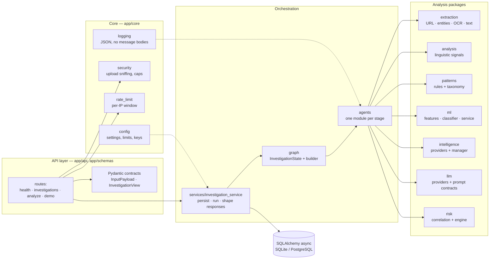
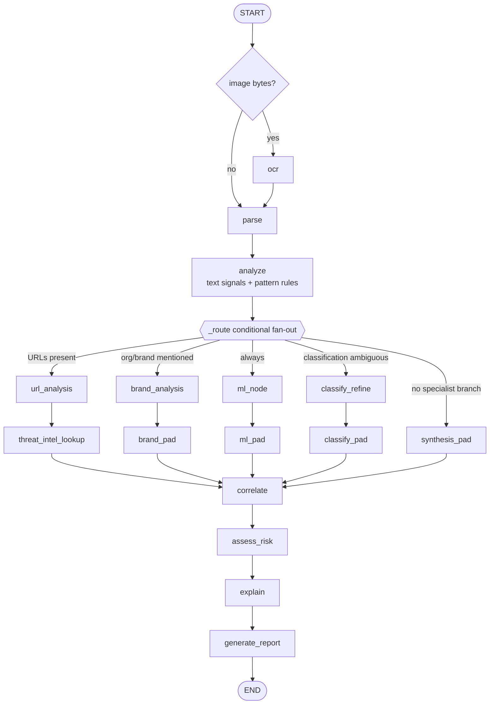

# Architecture — AI Digital Scam Investigator

> **Scope.** This is the engineering deep dive: how the system is actually built, which invariants
> are enforced in code, and where each behaviour lives. For the product overview — problem,
> capabilities, evaluation and quick start — read [../README.md](../README.md). The vocabulary used
> here (band, sufficiency, applicability, anchor, verdict versus status) is defined in
> [GLOSSARY.md](GLOSSARY.md).

An investigation is a **pipeline of deterministic, evidence-producing stages** wrapped in a
LangGraph workflow. Evidence is extracted and typed first; each channel is analysed independently;
the evidence is correlated with quality-aware weighting; a deterministic risk engine produces the
score, band, confidence and sufficiency; and an LLM (optional) synthesises an explanation strictly
from the evidence it is handed. The LLM is never part of the decision path.

## Contents

| # | Section | # | Section |
|---|---|---|---|
| 1 | [System overview](#1-system-overview) | 10 | [OCR architecture](#10-ocr-architecture) |
| 2 | [Component architecture](#2-component-architecture) | 11 | [LLM grounding](#11-llm-grounding-architecture) |
| 3 | [Request lifecycle](#3-request-lifecycle) | 12 | [Persistence](#12-persistence) |
| 4 | [LangGraph workflow](#4-langgraph-workflow) | 13 | [Security boundaries](#13-security-boundaries) |
| 5 | [Evidence model](#5-evidence-model) | 14 | [Failure handling](#14-failure-handling) |
| 6 | [Detection layers](#6-detection-layers) | 15 | [Observability and logging](#15-observability-and-logging) |
| 7 | [Risk engine](#7-risk-engine) | 16 | [Frontend and backend interaction](#16-frontend-and-backend-interaction) |
| 8 | [ML architecture](#8-ml-architecture) | 17 | [Deployment architecture](#17-deployment-architecture) |
| 9 | [Threat intelligence](#9-threat-intelligence-architecture) | | |

---

## 1. System overview

Three runtime pieces:

| Piece | Process | Responsibility |
|---|---|---|
| Frontend | Node (Next.js 15) | UI; proxies `/api/*` to the backend so the browser has a single origin |
| Backend | Python 3.13 (FastAPI + LangGraph) | Validation, orchestration, all analysis, scoring, explanation, persistence |
| Store | SQLite (local) or PostgreSQL (compose/cloud path) | Investigations, evidence rows, entities, per-stage results, risk assessments, reports |

Design invariants, each enforced by code rather than convention:

1. **Structured evidence precedes opinion.** Every analyser emits `EvidenceSignal` rows; no stage
   hands free-form prose to the next.
2. **Risk is deterministic and reproducible.** `risk/engine.py` computes the score from component
   scores and weights; nothing an LLM returns can alter it.
3. **Applicability, not silence, drives normalization.** Channels that could not have fired for a
   submission never dilute the score; channels that could have fired but found nothing can be
   dropped when the assessment is URL-anchored.
4. **No information is never good news.** Provider failures, rate limits, malformed inputs and
   no-record answers contribute nothing and never lower risk.
5. **Uncertainty is a first-class output.** `evidence_sufficiency` and confidence are reported
   alongside the band, and LOW conclusions are phrased so they cannot read as "verified safe".
6. **Mocks announce themselves.** `is_mock`, `[DEMO]` labels and provider modes propagate to the API
   response and the UI.
7. **The application never fetches user-supplied URLs.** URLs are analysed structurally and sent to
   reputation providers as values — there is no server-side request to attacker-controlled hosts.

---

## 2. Component architecture

Module dependency view (the runtime view is in [../README.md](../README.md#architecture)):

**Rule of thumb for changes:** analysis packages never import from `agents/`, and nothing outside
`risk/` decides a risk number. `patterns/match_rules` is also consumed by `ml/features.py`, which is
why changing rule matching requires retraining the shipped classifier (see [§8](#8-ml-architecture)).

---

## 3. Request lifecycle

`POST /api/investigations` (multipart: `text`, `urls[]`, `title`, `source_label`, `image`):

0. **Authentication** — `core/auth.py::get_current_user` validates the `Authorization: Bearer` token
   (signature, expiry, and `ver` against the account's `token_version`) and loads the `User`. A missing
   or invalid token is a `401` before any work happens. Every investigation row is written with the
   caller's `user_id`, and every read path is scoped to it.
1. **Rate limit and image gate** — `core/rate_limit.py` applies a per-IP sliding window
   (`RATE_LIMIT_PER_MINUTE`, default 30) before any work happens. A submission that carries a
   screenshot is *also* admitted through the in-process image-concurrency gate
   (`core/concurrency.py`), which bounds how many decodes + pipelines run at once
   (`MAX_CONCURRENT_IMAGE_OPS`, default 4) and returns a retryable `503` when every slot is taken,
   rather than queueing work whose pixel buffers would add up. Text/URL-only submissions bypass the
   gate.
2. **Upload validation** — `core/security.py::read_image_upload` reads at most
   `MAX_UPLOAD_MB + 1` bytes, rejects empty/oversized files, and requires Pillow to decode the
   bytes (the declared content type is ignored). The pixel cap is enforced **before** the decode:
   `Image.open` reads the header, `image.size` is compared against the 64 M cap, and `load()` — the
   step that allocates the pixel buffer — only runs once the image is known to be within it. Pillow's
   own guard is also translated: `DecompressionBombError` and `DecompressionBombWarning` derive from
   `Exception`, not `OSError`, so they are named explicitly and become the same `400` as every other
   rejection rather than escaping as a server error. The decode is CPU- and memory-bound, so it runs
   in a worker thread (`run_in_executor`) and does not block the event loop.
   The validated bytes are then held **in memory** for the request and never written to disk:
   no upload file is created, so there is nothing to clean up and no user-influenced name reaches the
   filesystem.
3. **Contract validation** — `InputPayload` enforces `MAX_TEXT_LENGTH` (50,000) and
   `MAX_URLS_PER_SUBMISSION` (20) and strips blank URLs.
4. **Persistence start** — `investigation_service.create_and_run` inserts the investigation row with
   `status="running"`.
5. **Workflow** — the prepared `InvestigationState` (normalised text, explicit URLs, image bytes,
   `input_types`) runs through the compiled LangGraph (§4).
6. **Finalisation** — `_persist` writes the risk assessment, report, evidence rows, extracted
   entities and one `analysis_results` row per timeline stage, then sets the investigation status to
   the workflow's terminal status (`completed`, or `failed` with the error list).
7. **Response shaping** — read paths (`to_summary`, `get_view`, `list_investigations`) rebuild the
   API payload from the stored rows, including the timeline reconstructed from `analysis_results`.
8. **Delete** — `DELETE /api/investigations/{id}` returns 204 or 404.

The request is **synchronous**: the HTTP response is returned only after the workflow finishes, so
live provider latency is part of the request. There are no queues or background workers.

---

## 4. LangGraph workflow

Node inventory:

| Node | Module | Emits |
|---|---|---|
| `ocr` | `agents/ocr_node.py` | `ocr_text`, `ocr_confidence`, `ocr_provider`, `ocr_mock` |
| `parse` | `agents/parser_node.py` | `normalized_text`, `entities`, initial evidence |
| `analyze` | `agents/text_analysis_node.py` | `text_signals`, `scam_patterns`, `pattern_matches`, `classification` |
| `url_analysis` | `agents/url_analysis_node.py` | `urls`, `url_signals` |
| `threat_intel_lookup` | `agents/threat_intel_node.py` | `threat_intel` |
| `brand_analysis` | `agents/entity_analysis_node.py` | `entity_analysis` |
| `ml_node` | `agents/ml_node.py` | `ml_prediction` |
| `classify_refine` | `agents/classify_node.py` | refined `classification` (or a rejected suggestion) |
| `correlate` | `agents/correlation_node.py` | `correlation` (themes, corroboration, conflicts, consistency) |
| `assess_risk` | `agents/risk_node.py` | `risk` |
| `explain` | `agents/explain_node.py` | `explanation` |
| `generate_report` | `agents/report_node.py` | `report` |

Routing rules (`builder._route`):

- `url_analysis` + `threat_intel_lookup` run **only when URLs exist** (explicit or extracted).
- `brand_analysis` runs **only when a company/bank/organization entity was extracted**.
- `ml_node` runs **always**.
- `classify_refine` runs **only when the rules classification is ambiguous**
  (`patterns.engine.is_ambiguous`: `unknown`, or confidence < 0.5). Deterministic classification is
  never second-guessed by a model.

State mechanics (`graph/state.py`):

- `evidence`, `timeline`, `errors`, `warnings` use LangGraph's `operator.add` reducer, so parallel
  branches append safely.
- `correlation` and `processing_metadata` use a custom `merge_metadata` reducer that merges nested
  per-stage dictionaries instead of replacing them.
- Node names deliberately avoid state-channel names; LangGraph forbids registering a node whose name
  collides with a channel.

Two defensive details worth knowing before editing the graph:

- **Equal-depth branches.** langgraph 0.2.x mis-schedules merges of unequal-depth branches (the
  merge target and everything after it execute twice). Zero-op `*_pad` nodes give every active
  branch exactly two hops to `correlate`, and a `synthesis_pad` path exists for submissions where no
  specialist branch runs. `run_investigation` additionally sorts and de-duplicates the timeline by
  stage.
- **Failure containment.** If the workflow raises, `run_investigation` records
  `status="failed"` plus the error and a coherent timeline instead of propagating the exception, so
  a provider or node bug degrades one investigation rather than the API.

---

## 5. Evidence model

`EvidenceSignal` (`schemas/evidence.py`) is the currency of the pipeline:

| Field | Type | Meaning |
|---|---|---|
| `source` | str | Producing channel: `url_analysis`, `threat_intelligence`, `scam_pattern`, `text_analysis`, `entity_analysis`, `ml_classifier` |
| `signal` | str | Short machine-readable code, e.g. `URL_RISK`, `CREDENTIAL_REQUEST`, `PATTERN_MATCH` |
| `severity` | str | `low` / `medium` / `high` / `critical` (ordered map `low=1 … critical=4`) |
| `confidence` | float | 0–1 confidence in that single observation |
| `description` | str \| None | Human-readable explanation shown in the UI |
| `detail` | dict | Structured payload (matched rule, URL findings, provider verdicts, feature contributions) |

Correlation (`risk/correlation.py`) then:

1. **de-duplicates** by `(source, signal)`;
2. **groups** signals into themes — `url_risk`, `external_reputation`, `scam_pattern`,
   `language_signals`, `brand_impersonation`, `ml_prediction` (unknown sources fall back to their own
   name);
3. marks a theme **corroborating** when its worst signal is `medium` or above;
4. detects **conflicts** (e.g. a provider says *safe* while local signals are suspicious) and
   computes a **`consistency_score`** — `0.4` when nothing corroborates, `0.75` for one
   corroborating theme, `0.9` for two, `1.0` for three or more, minus `0.2` on conflict;
5. builds the deterministic **conclusion** text, using the sufficiency label so a LOW result can
   never be phrased as a clean bill of health.

This runs *before* the LLM so the explanation agent can reference pre-correlated facts.

---

## 6. Detection layers

| Layer | Module | Method | Feeds |
|---|---|---|---|
| URL structure | `extraction/url_analysis.py` | Non-fetching analysis: lookalike/homoglyph brands, punycode, IP hosts, dangerous schemes, ports, subdomain depth, credential paths, shortener fingerprints, sensitive query params, missing HTTPS | `url_signals` (evidence) + `urls[].risk_score` |
| Linguistic signals | `analysis/text_signals.py` | Phrase groups (urgency, fear/threat, reward, pressure, authority, payment/credential/OTP/sensitive requests, suspicious instructions, protective, reassurance) plus numeric regex variants | `text_signals` (scores + hit lists) |
| Scam patterns | `patterns/rules.py` + `patterns/engine.py` | Declarative `ScamRule`s: literal keywords **and** compiled regex `patterns`, optional `required_entities` and `requires_request_context` gates; category ranking by summed weight, tie-broken by hit count | `scam_patterns` (evidence) + category classification |
| Entities / brand | `extraction/entity_extractor.py` + `agents/entity_analysis_node.py` | URLs, emails, phones, amounts, dates, companies, banks, organizations; lookalike comparisons | `entities` + impersonation evidence |
| Machine learning | `ml/` | 18-feature logistic-regression probability | `ml_prediction` (one weighted signal) |
| External reputation | `intelligence/` | Google Safe Browsing + VirusTotal lookups by URL value | `threat_intel` (evidence + anchor decision) |

Two semantics that keep the layers honest:

- **Request vs mention.** A mention of an OTP, password or payment is not a request; request
  channels need a requestive verb, and protective/reassurance language suppresses alarm rules.
- **Status vs demand.** Rules with `requires_request_context` (delivery status, tracking) only fire
  when the message also asks for something or applies pressure; a link alone does not lift the gate,
  because genuine notices carry official links while scammy links are scored by the URL and intel
  channels independently.

---

## 7. Risk engine

`risk/engine.py::compute_risk` is a weighted sum over **participating** channels, normalised and
turned into a band.

| Channel | Default weight |
|---|---|
| Pattern rules | 0.35 |
| Threat intelligence | 0.25 |
| URL risk | 0.18 |
| Credential request | 0.12 |
| OTP request | 0.12 |
| Payment request | 0.10 |
| ML probability | 0.10 |
| Entity impersonation | 0.08 |
| Suspicious instructions | 0.08 |
| Urgency | 0.07 |
| Sensitive info | 0.07 |
| Consistency | 0.05 |

Weights are overridable at runtime through `RISK_WEIGHTS_PATH`.

Rules that decide who participates:

- **Applicability** — a channel with no possible input (URL risk on a text-only message) is not in
  the denominator at all. In `agents/risk_node.py`, `pattern_score` is
  `min(1.0, Σ matched weights / 4.0)`, and the ML channel participates only when a prediction exists.
- **Intel informativeness** — the intel channel counts only when a provider returned a *usable*
  verdict (`safe`/`suspicious`/`malicious` with `status=ok`). `unknown`, `error`, `unavailable` and
  `rate_limited` are no information: they neither contribute nor dilute.
- **URL anchoring** — (`URL_ANCHOR_MIN = 0.4`, or an intel verdict of suspicious/malicious) when the
  assessment is URL-anchored, applicable channels whose score is below `CHANNEL_SILENT_MAX = 0.2`
  drop out of the denominator too, so a credential-harvesting URL beside neutral text is not diluted
  to LOW.
- **Consistency** — the correlation `consistency_score` is itself a weighted channel, so
  contradictions dampen the score rather than being averaged away.
- **Confidence and sufficiency** — derived from the same evidence pool (`INSUFFICIENT_MAX = 0.35`,
  `SUFFICIENT_MIN = 0.60`); sparse submissions report `INSUFFICIENT`/`PARTIAL` instead of a confident
  verdict.

Bands: `LOW` 0–24 · `MEDIUM` 25–49 · `HIGH` 50–74 · `CRITICAL` 75–100.

Every assessment returns `RiskContributor` rows (`name`, `impact` in −1…1, `detail`,
`evidence_sources`) so the UI's "Why this score?" panel is rendered from the actual arithmetic
rather than a narrative.

---

## 8. ML architecture

**Features (18, `ml/features.py::FEATURE_NAMES`)** — `message_length`, `word_count`,
`special_char_frequency`, `uppercase_ratio`, `urgent/fear_threat/reward/pressure/authority` scores,
`payment_request`, `credential_request`, `otp_request`, `sensitive_info_request`, `has_phone`,
`has_email`, `amount_count`, `scam_keyword_hits`, `punctuation_ratio`.

The **same** `extract_features` function is used by training and by `agents/ml_node.py`, so the
model sees the distribution it was trained on. URL-*presence* features are intentionally absent:
this product investigates suspicious URLs by design, so presence is uninformative, and training on
it made the SMS-trained model flag any URL-bearing message as spam. URL risk is scored by the
dedicated channel instead.

**Pipeline** — `StandardScaler` → `LogisticRegression(max_iter=2000, C=0.8, class_weight="balanced")`,
persisted with joblib to `ML_MODEL_PATH`. `ml/service.py` loads it once; if the artifact is missing
or unreadable the service falls back to a deterministic heuristic and labels the result as such
(never as a model prediction).

**Training** (`scripts/ml_training/train.py`, `--dataset … --no-categories`, seed 42):

1. The validated loader (`ml/dataset.py`) enforces the schema (`text`/`label` required, valid
   categories when used), rejects malformed rows, removes exact duplicates and reports statistics.
2. It **refuses** anything under `data/evaluation/` and rejects rows whose ids collide with
   evaluation cases, so the calibration corpus can never leak into training metrics.
3. A deterministic stratified split (default 0.2 test / 0.1 validation) is produced; the reported
   metrics come from the held-out test split.
4. `ML_DECISION_THRESHOLD` (default `0.55`) is the max-F1 operating point chosen on the validation
   split. It only affects the *reported label*: the risk engine consumes the raw probability as one
   weighted signal.

**Shipped artifact** — trained on the real UCI SMS Spam Collection v.1 (5,159 rows, CC BY 4.0),
held-out accuracy 0.9312 · precision 0.6748 · recall 0.8594 · F1 0.7560 · ROC-AUC 0.9707. Because
rule matching produces the `scam_keyword_hits` feature, **changing `patterns/rules.py` or the engine
invalidates the artifact** and it must be retrained and re-validated before the change ships.

**Why the smallest weight.** The corpus is SMS spam/ham supervision — 13% prevalence, English-only,
no URL-bearing rows — so it cannot represent phishing, URL, crypto, impersonation or screenshot
threats. The model contributes one probabilistic signal at weight `0.10`; categories beyond SMS spam
are carried by the deterministic channels.

---

## 9. Threat intelligence architecture

Every provider implements the same contract (`intelligence/base.py`) and returns a normalised
`ThreatIntelResult`: `provider`, `verdict` (`safe`/`unknown`/`suspicious`/`malicious`), `status`
(`ok`/`error`/`unavailable`/`rate_limited`), `risk_score`, `reputation`, `categories`, `hits`,
`is_mock`, `error`, `checked_at` and a per-provider `detail` block. Normalising at the boundary is
what lets the risk engine reason about quality instead of provider-specific shapes.

| Provider | Endpoint | Auth | Notes |
|---|---|---|---|
| `google_safe_browsing` | Threat Matches `v4` lookup | `x-goog-api-key` **header** | Never a query parameter — request URLs are logged by HTTP clients and proxies |
| `virustotal` | `GET /urls/{id}` (`v3`) | `x-apikey` header | `id` is the base64url (unpadded) encoding of the URL; a `404` is translated to "not seen", not to "safe" |
| `mock` | — | — | Used only when no key is configured; labels itself `is_mock` |

`intelligence/manager.py` builds the provider list from configured keys (mock only as the fallback),
queries all providers **concurrently** with `asyncio.gather`, and merges the results:

- **Worst verdict wins** (`safe 0 < unknown 1 < suspicious 2 < malicious 3`) and `risk_score` is the
  maximum across providers — safety-first aggregation, so one malicious verdict is never averaged
  away by a clean one.
- **Status semantics.** `status = ok` as soon as *any* provider produced a real verdict; otherwise the
  most severe failure state is surfaced (`error` < `unavailable` < `rate_limited`), so an outage is
  visible rather than masquerading as "no result".
- **Nothing is lost.** `hits` is summed, `categories` are unioned, and every provider's own row stays
  in `detail.providers` for the UI and the audit trail.

The provider call is the only outbound request in the system, and it transmits the URL **as a value**
to a reputation service — the application never dereferences it (see [§13](#13-security-boundaries)).
Adding a provider, including the exact failure taxonomy you must implement, is documented in
[PROVIDERS.md](PROVIDERS.md).

---

## 10. OCR architecture

Screenshots enter through the same pipeline as text. `extraction/ocr.py` defines an `OCRProvider`
interface with two implementations:

| Provider | Behaviour |
|---|---|
| `tesseract` | Renders the validated image to PNG in a temp directory and runs `tesseract  stdout --psm 3 -l eng` in a thread, with a 60 s subprocess timeout. Images outside `RGB`/`L` are converted, and oversized images are downscaled to a pixel cap before recognition. |
| `mock` | The honest fallback: extracts nothing, returns `is_mock=True`, and reports why. |

`get_ocr_provider()` honours `OCR_PROVIDER` (`auto` / `tesseract` / `mock`); `auto` selects Tesseract
only when the configured binary actually resolves on `PATH`.

Honesty rules in `agents/ocr_node.py`:

- A missing binary, a non-zero exit or an unreadable image yields **empty text plus an `error` and a
  visible warning**. No text is ever fabricated from an image.
- A mock run emits an `ocr_mock` evidence signal so downstream stages and the UI can tell "nothing was
  extracted" apart from "the screenshot was clean".
- Tesseract's per-word confidence requires TSV output, so the provider returns a **conservative
  indicative** value rather than a precise-looking number that was never measured.

Extracted text is folded into `normalized_text` and then flows through parse → analyse → correlate →
risk exactly like typed input — there is no separate, weaker path for screenshots.

---

## 11. LLM grounding architecture

The LLM is an **explanation and phrasing layer**, never a decision path. It is invoked only at three
points, each of which receives a structured, pre-computed context rather than raw authority:

| Call site | Purpose | Constraint |
|---|---|---|
| `explain_node` | Explain the findings in calibrated prose | Prompt contract: evidence-only; a `limitations` field for what could **not** be verified |
| `report_node` | Compose the human-readable report | Same `ReportContext`; the deterministic risk block is passed in as facts |
| `classify_node` | Suggest refining an *ambiguous* category | Only called when `patterns.engine.is_ambiguous`; the suggestion is rejected unless deterministic evidence already supports it, and a rejection is recorded |

`ReportContext` is assembled from `InvestigationState` (entities, URLs, text signals, pattern signals,
threat intel, ML prediction, entity analysis, classification, risk, evidence, timeline). The system
prompt is the shared `EVIDENCE_ONLY_SYSTEM` contract: reason **only** from supplied evidence, never
state an objective without supporting evidence, and emit JSON. Because the risk score, band and
sufficiency are already computed before this call, no model output can move them.

Provider selection is a two-branch factory (`llm/manager.py`): `openai_compatible` when
`LLM_PROVIDER=openai_compatible` **and** a key is present, otherwise `mock`. `deterministic.py`
provides template-based text for the offline path, and a provider failure falls back to it, so an
investigation always produces a readable explanation. Any OpenAI-compatible endpoint works
(`LLM_BASE_URL`), which is how Gemini and OpenAI-style gateways are both supported without
provider-specific code.

---

## 12. Persistence

Async SQLAlchemy 2 (`database.py`). The engine is created once from `DATABASE_URL`.

Schema is managed by **Alembic** (`backend/alembic/`). `alembic upgrade head` is the single documented
initialization path, run by the container entrypoint on start and by the PostgreSQL integration check
in CI; the migration is idempotent. `create_tables()` still runs `Base.metadata.create_all` in the
FastAPI lifespan as a zero-setup convenience for local SQLite and tests — it only adds missing tables
and becomes a no-op after a migration.

| Table | Contents |
|---|---|
| `users` | Account: unique email, bcrypt `password_hash`, display name, `token_version` |
| `investigations` | Owner (`user_id`, indexed, nullable for pre-auth rows), submission metadata, input types, status, timestamps |
| `evidence` | One row per `EvidenceSignal` (source, signal, severity, confidence, description, detail) |
| `extracted_entities` | URLs, emails, phones, amounts, dates, companies, banks, organizations |
| `analysis_results` | One row per timeline stage — this is what the UI timeline and the API view are rebuilt from |
| `risk_assessments` | Score, band, confidence, sufficiency, contributors |
| `reports` | The generated report payload |

Reads rebuild the API response from stored rows rather than from memory, so a result page renders
identically after a restart. Filters are written to be portable across SQLite and PostgreSQL
(`json_extract` vs `->>` / `.astext`); the dialect switch is chosen from `DATABASE_URL`, not from a
hardcoded assumption. SQLite is single-writer and is the verified local path; PostgreSQL 16 via
`postgresql+asyncpg://` is the deployment path and requires `asyncpg`.

**Ownership.** `investigations.user_id` is the multi-tenancy boundary. List, detail and delete all
filter on it **inside the query** (`WHERE user_id = :me`), so a foreign id returns `None` — the same
`404` as a missing row — rather than being fetched and then rejected. A nullable column lets a
database created before authentication migrate without a backfill; such legacy rows are invisible to
every account and are never returned anonymously.

---

## 13. Security boundaries

| Boundary | Enforcement |
|---|---|
| **No SSRF.** | The server never fetches a user-supplied URL. URLs are parsed structurally and sent to reputation providers as *values*; there is no `requests.get(user_input)` path anywhere. |
| **Upload safety.** | `core/security.py::read_image_upload` caps bytes at `MAX_UPLOAD_MB + 1`, rejects empty files, ignores the declared content type and requires Pillow to decode the bytes. Dimensions are read from the header and compared against a 64 M-pixel cap **before** `load()` allocates the pixel buffer, so an oversized image is rejected without being decompressed; Pillow's `DecompressionBombError` / `DecompressionBombWarning` and a decode-time `MemoryError` are converted to the same `400`. The decode runs in a worker thread, and the whole image submission is admitted through the bounded concurrency gate (below) so its pixel buffer cannot be multiplied without limit. Nothing is written to disk; the bytes are used in memory and discarded. |
| **Input limits.** | `MAX_TEXT_LENGTH` (50,000) and `MAX_URLS_PER_SUBMISSION` (20) are enforced by the `InputPayload` contract before any analysis runs. |
| **Rate limiting.** | `core/rate_limit.py` applies a per-IP sliding window (`RATE_LIMIT_PER_MINUTE`, default 30) ahead of the work, including on register/login (brute-force resistance). |
| **Authentication.** | `core/auth.py` hashes passwords with **bcrypt** and never stores, returns or logs the plaintext; tokens are signed JWTs (`HS256`) with an expiry, signed only with the environment-supplied `AUTH_SECRET_KEY`. A token is rejected unless its signature, expiry and `ver` claim all check out. The OpenAPI security scheme is `HTTPBearer`, so `/docs` reflects the requirement. |
| **Authorization / multi-tenancy.** | Ownership is a column filtered in the query, not a post-hoc check: list returns only the caller's rows, and detail/delete of another account's id returns `404` rather than `403`, so a caller cannot learn whether an id exists. Covered by `tests/test_authorization_isolation.py`. |
| **Token handling in the browser.** | The token is held in `localStorage` and sent as a bearer header; no token or key is ever placed in a `NEXT_PUBLIC_*` variable. `localStorage` is readable by any script on the origin, so XSS is a real residual risk (there is no third-party script in the app today) — recorded rather than hidden. |
| **Bounded image concurrency.** | `core/concurrency.py` admits at most `MAX_CONCURRENT_IMAGE_OPS` (default 4) image investigations at once and returns `503` otherwise; the slot is released in a `finally`. The counter is **per process**, so a multi-worker deployment multiplies the effective ceiling by the worker count — a memory safety valve, not a global or DDoS limit ([SECURITY.md](SECURITY.md) §2). |
| **Keys stay server-side.** | Provider keys are read from the backend environment only. The frontend has no `NEXT_PUBLIC_*` variable and never receives a key; the browser only talks to the Next.js origin. |
| **Header auth.** | Both threat-intel providers authenticate by header because request URLs leak into client/proxy logs. |
| **No dynamic execution.** | No `eval`, `exec`, `pickle` on untrusted data or shell interpolation of user input; the only subprocess is a `tesseract` invocation with a fixed argument vector. |
| **Path safety.** | No route writes an upload to disk, so a user-influenced name never reaches the filesystem. `sanitize_filename` (unused today) strips path components and unsafe characters should one ever be handled. |
| **CORS.** | Explicit origin list, `allow_credentials=False`; no wildcard in the defaults. |

---

## 14. Failure handling

Failures are classified by what they mean for the *evidence*, not by whether code threw:

| Failure | Handling | Effect on risk |
|---|---|---|
| Provider HTTP error / exception / timeout | Converted to a normalised non-verdict (`status=error` / `unavailable`, `verdict=unknown`) by the manager's `_safe_check` wrapper | **None** — no information neither raises nor lowers the score |
| Provider rate limit | `status=rate_limited`, visible per provider | None; never treated as clean |
| OCR unavailable | Empty text + warning + `ocr_mock` evidence | None |
| ML artifact missing/unreadable | Deterministic heuristic fallback, labelled as a heuristic rather than a model prediction | The ML channel is not credited as a model result |
| LLM failure or missing key | Deterministic template explanation | None — the explanation is not part of the decision |
| A workflow node raises | `run_investigation` records `status="failed"` plus the error and a coherent timeline instead of propagating | The investigation is reported as failed rather than mis-scored |
| Bad upload / bad contract | `400` from the API before the workflow starts | No investigation is created |

The unifying rule: **a degradation is always visible and never silently improves a verdict.**

---

## 15. Observability and logging

- `core/logging.py` installs a single-line JSON formatter (`ts`, `level`, `logger`, `msg`, optional
  `exc`, plus `extra_fields`) on the root logger; level is `DEBUG` only when `DEBUG=true`.
- Every investigation logs through `investigation_logger(id)`, which binds the `investigation_id` as an
  extra field, so one submission's lines can be filtered from a busy stream.
- **Message bodies are never logged.** Code paths log identifiers, stage names, counts and provider
  statuses — not user content.
- `httpx`, `httpcore`, `urllib3` and `asyncio` are pinned to `WARNING` because their request logs
  contain full URLs, which can carry a credential in a query parameter and always carry the
  user-submitted link.
- `/api/health` is the operational truth source: it reports the **effective** provider modes
  (`is_mock` / `uses_mock` / OCR provider / LLM provider), so a misconfigured deployment is visible
  from outside instead of surfacing as unexplained low-risk results.
- The timeline (`analysis_results`) is the durable, per-stage record returned to the UI.

---

## 16. Frontend and backend interaction

The browser only ever talks to the **frontend origin**. `next.config.mjs` rewrites `/api/:path*` to
`${BACKEND_URL}/api/:path*` (default `http://localhost:8000`), which means no CORS setup is needed
for the UI and no backend URL or key is exposed to client code.

| Concern | Where it lives |
|---|---|
| API client | `frontend/lib/api.ts` — typed calls to the `/api` paths; attaches the bearer token and, on a `401`, clears the session and routes to `/login` |
| Session storage | `frontend/lib/auth.ts` — token + user in `localStorage` |
| Route guard | `frontend/components/auth-guard.tsx` wraps the `(app)` group; the backend remains the real authority |
| Pages | `/` (landing), `/login`, `/register`, `/investigate`, `/dashboard`, `/history`, `/results/[id]` |
| Result rendering | The result page renders the risk gauge, evidence groups and timeline; the "Why this score?" panel is driven by the `RiskContributor` rows, and mock/demo state is shown explicitly rather than hidden |
| Styling | Tailwind CSS; `lucide-react` for icons |

The API surface consumed by the UI: `POST /api/auth/register`, `POST /api/auth/login`,
`GET /api/auth/me`, `POST /api/auth/logout`, `GET /api/health`, `POST /api/investigations`,
`GET /api/investigations`, `GET /api/investigations/{id}`, `DELETE /api/investigations/{id}`,
`POST /api/analyze`, and the demo routes under `/api/demo`.

---

## 17. Deployment architecture

Three services, two supported database paths, one honest caveat per path.

| Concern | Local (verified) | Container / cloud (unverified here) |
|---|---|---|
| Store | SQLite at `backend/data/app.db` | PostgreSQL 16 via `postgresql+asyncpg://` |
| Backend | `uvicorn app.main:app` (port 8000) | `backend/Dockerfile` (`python:3.13-slim` + `tesseract-ocr`) |
| Frontend | `next dev -p 3000` / `next start` | Node host with `BACKEND_URL` pointing at the backend |
| Orchestration | Two terminals | `docker-compose.yml` (postgres + backend + frontend) |
| Schema | Alembic migrations (`alembic upgrade head`) | Same — the container entrypoint runs the migrations before starting the API |
| Auth | JWT bearer tokens, `AUTH_SECRET_KEY` from the environment | Same; `AUTH_SECRET_KEY` **must** be set in `.env` |

**Verification status, stated plainly.** SQLite, the FastAPI app, the LangGraph workflow, the
authentication and isolation behaviour, the load/concurrency behaviour, the ML artifact, the frontend
build and the live Safe Browsing / VirusTotal / Gemini / Tesseract integrations were executed and
verified locally. The **PostgreSQL path has a migration and an opt-in integration suite but was not
verified here** (no server installed), and **the Docker path was not exercised** (no Docker CLI was
available). Nothing in this document should be read as a claim that a container deployment or a
PostgreSQL instance has been run.

Operational consequences worth designing around:

- The request is **synchronous** and provider latency is in the request path, so a slow upstream
  directly lengthens a user-visible call; there is no queue to absorb it.
- The backend holds no session state beyond the database, so it scales horizontally — but SQLite is
  single-writer, so multi-replica deployments require PostgreSQL.
- The `/api/health` provider block is the fastest way to confirm a deployment is actually wired to the
  keys it claims to have.

---

## 18. Concurrency and rate limiting: why per-process (a decision record)

Both the per-IP rate limiter (`core/rate_limit.py`) and the image-concurrency gate
(`core/concurrency.py`) are **in-process**. This section records why that is the current answer and
what would change it — so the choice is deliberate rather than accidental.

**What is actually deployed.** The supported deployment topologies are a single `uvicorn` process
(local), the compose stack's single backend container, and a single container host. None of these runs
multiple workers by default, so a per-process limiter *is* a whole-deployment limiter for the shipped
configuration.

**The cost of the alternative.** A shared limiter needs shared state. PostgreSQL *could* back one
(with `SELECT … FOR UPDATE` or an advisory lock), but doing a database round-trip on the hot submission
path to guard against a case that multi-worker deployment does not yet create would add a new
bottleneck and a new failure mode (the limiter becomes unavailable when the database is slow). Redis
would solve it cleanly but introduces infrastructure the project does not otherwise need. Neither is
justified by the current deployment model.

**Documented limitation, stated in the operators' terms.** Under `W` workers the effective ceilings are:

| Control | Effective ceiling |
|---|---|
| Image concurrency | `W × MAX_CONCURRENT_IMAGE_OPS` |
| Per-IP rate limit | `W × RATE_LIMIT_PER_MINUTE` (each worker keeps its own window) |

Both reset on restart, and both are per-host: running the backend on two hosts doubles them again.
They remain safety valves — a bound on simultaneously-decoded pixel buffers and on submission flood —
not a global quota and not a DDoS defence.

**Revisit when** the deployment actually runs multiple workers or replicas *and* either control is
load-bearing. At that point the least-effort correct option is a PostgreSQL-backed fixed-window counter
(one table, one `INSERT … ON CONFLICT … RETURNING`), because the database is already a required
dependency; Redis remains the option only if the limiter must survive database unavailability.
